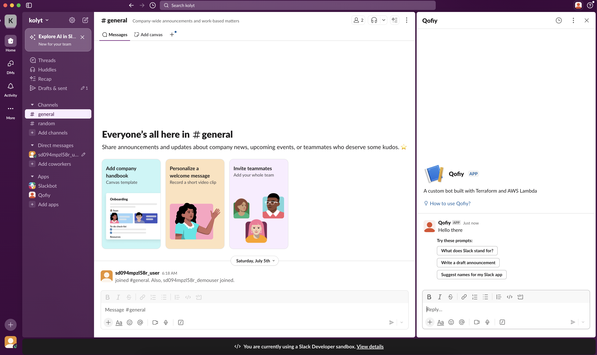
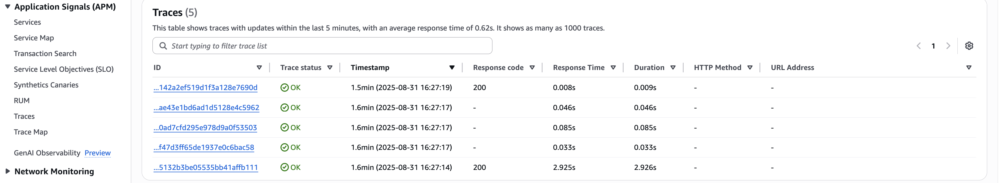
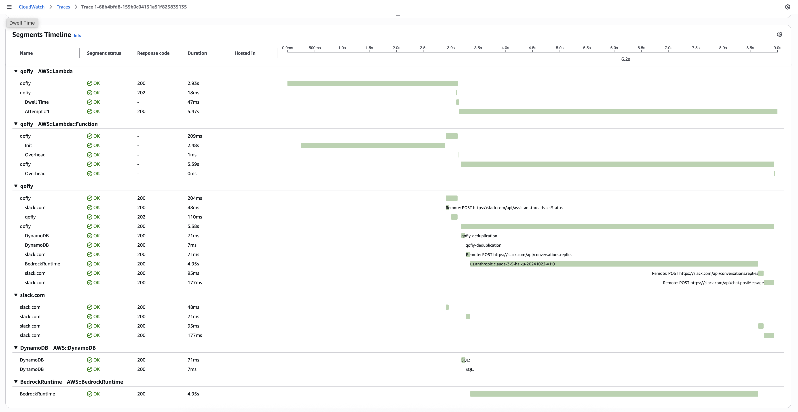
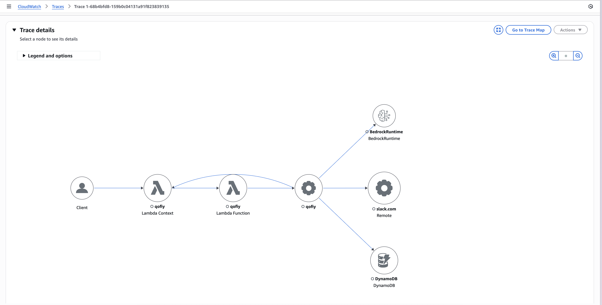

+++
title = "Build a Slack AI app powered by Amazon Bedrock"
slug = "ai-apps-in-slack-bedrock"
description = "Build a Slack app with AI features"
date = "2025-08-31"
[taxonomies] 
tags = ["aws", "terraform", "slack", "gen-ai", "iac", "bedrock", "llms", "ai", "generative-ai", "chatops"]
+++

### Introduction

I've always found the idea of ChatOps alluring. However, many ChatOps tools were ultimately hamstrung by their inability to understand intent from natural language, the requirement to hard code the logic necessary to perform the users intention in advance, and a [host of other reasons](https://www.reddit.com/r/devops/comments/exwb9u/why_arent_chatops_more_popular/). Regardless, ChatOps can be a [very powerful tool](https://github.blog/engineering/infrastructure/using-chatops-to-help-actions-on-call-engineers/) for helping teams get thing done. 

With LLM's and Gen AI, I think ChatOps is worth revisiting. LLM's are fantastic at intent recognition and depending on your risk tolerance, you can now let the foundational model loose on a problem (ideally in a secure sandbox), give it access to tools via [MCP](https://github.com/awslabs/mcp/), and just sit back and watch magic happen. 

This is also a particularly good time to work on this as Slack recently released support for [developing apps with AI features](https://docs.slack.dev/ai/developing-ai-apps/). These AI powered apps let you open them in dedicated pane, which means, you can work on them side-by-side your other open channels. 



I'd like to explore what LLM's can offer ChatOps by building an AI agent to help with security automation. But this post is not about that. Before going all in, I wanted to see how easily I could hook up a Slack App to AWS Bedrock. Turns out, its pretty straightforward. If you're a CloudFormation nerd, check out [Deploy a Slack gateway for Amazon Bedrock](https://aws.amazon.com/blogs/machine-learning/deploy-a-slack-gateway-for-amazon-bedrock/). But since Terraform is my IaC tool of choice, I borrowed the ideas from that post to create [slackbot-lambdalith](https://registry.terraform.io/modules/mbuotidem/slackbot-lambdalith/aws/latest).


### Setting up the infrastructure

[Slackbot-lambdalith](https://registry.terraform.io/modules/mbuotidem/slackbot-lambdalith/aws/latest) lets you setup a Slack AI app where all the functionality lives in [a single Lambda function](https://aws.amazon.com/blogs/compute/comparing-design-approaches-for-building-serverless-microservices/#:~:text=Lambda%2Dlith%3A%20Using%20one%20single%20Lambda%20function). This design choice is deliberate as it makes prototyping quicker. 

Since we have a dependency on AWS Bedrock, make sure to [request model access](https://docs.aws.amazon.com/bedrock/latest/userguide/model-access-modify.html) in advance. You will also need to apply the terraform twice, the first time to generate the `manifest.json` which you can use to setup the Slack app. And the second time to wire everything up properly with the required credentials. See the [setup guide](https://registry.terraform.io/modules/mbuotidem/slackbot-lambdalith/aws/latest#setup) for detailed instructions. 

```
module "slack_bot" {
  source = "mbuotidem/slackbot-lambdalith/aws"

  slack_bot_token      = var.slack_bot_token
  slack_signing_secret = var.slack_signing_secret

  # Optional: Customize your Slack app manifest
  slack_app_name                  = "Qofiy"
  slack_app_description           = "A custom bot built with Terraform and AWS Lambda"
  slack_slash_command             = "/slash-command"
  slack_slash_command_description = "Executes my custom command"
  lambda_function_name            = "qofiy"
  lambda_source_path              = "./lambda"
  lambda_source_type              = "directory"
  bedrock_model_id                = "anthropic.claude-3-5-haiku-20241022-v1:0"
  bedrock_model_inference_profile = "us.anthropic.claude-3-5-haiku-20241022-v1:0"
  lambda_env_vars = {
    "BEDROCK_MODEL_INFERENCE_PROFILE" = "us.anthropic.claude-3-5-haiku-20241022-v1:0"
  }
  use_function_url           = true
  enable_application_signals = true


  tags = {
    Environment = "production"
    Project     = "slack-bot"
  }
}

```

Two key settings here are `use_function_url` and `enable_application_signals`. While the module supports API Gateway, I went with the function url option for simplicity. And because we're building a chat app - keeping an eye on latency and overall performance is key to a good user experience. 



And as you can see above, enabling [application signals](https://aws.amazon.com/blogs/aws/amazon-cloudwatch-application-signals-for-automatic-instrumentation-of-your-applications-preview/) gives us automatic instrumentation so we can interrogate our apps performance with with traces that included critical response-time metrics. More on this later. 

### Our lambda function

Here's how our lambdalith is setup. It's loosely modeled after the [bolt-python-assistant-template](https://github.com/slack-samples/bolt-python-assistant-template/tree/main) put out by Slack. 

```
 16:39:45 ~/slackbot/lambda 
$ tree
.
├── index.py
├── listeners
│   ├── __init__.py
│   ├── assistant.py
│   └── llm_caller.py
├── requirements.txt
└── utils
    ├── __init__.py
    └── deduplication.py

3 directories, 9 files
```
#### Entrypoint
Our entry point is `index.py` where we have our lambda function handler. Since Slack requires responses within 3 seconds but Bedrock calls can take longer, we use [lazy listeners](https://docs.slack.dev/tools/bolt-python/concepts/lazy-listeners/) - Lambda quickly acknowledges the request, then asynchronously invokes itself again to do the actual AI work. 


```python
from slack_bolt import App
from slack_bolt.adapter.aws_lambda import SlackRequestHandler

from listeners import register_listeners

# process_before_response must be True when running on FaaS
# See https://tools.slack.dev/bolt-python/concepts/lazy-listeners/ 
app = App(
    process_before_response=True, signing_secret=slack_signing_secret, token=slack_token
)

def handle_challenge(event):
    body = json.loads(event["body"])

    return {
        "statusCode": 200,
        "headers": {"x-slack-no-retry": "1"},
        "body": body["challenge"],
    }

def handler(event, context):
    if event_body.get("type") == "url_verification":
        response = handle_challenge(event)
        return response
    else:
        register_listeners(app)
        slack_handler = SlackRequestHandler(app=app)
        return slack_handler.handle(event, context)
```

https://github.com/slackapi/bolt-js/issues/2073

### Listeners

The Slack Bolt SDK provides the convenient [`Assistant` class](https://docs.slack.dev/tools/bolt-python/concepts/ai-apps/#assistant-class). It handles incoming events from users interacting with your Slack AI app. The two listener's we're using are the `@assistant.thread_started` and `@assistant.user_message`. Together, these allow you to piece together both interactivity and affordances to help you user along. 

#### @assistant.thread_started
This is invoked when your user opens an assistant thread. You can use it as we do here to say something nice and helpful, or you could use it to [seed the first interaction with prompts](https://docs.slack.dev/ai/developing-ai-apps/#respond-assistant-thread-started-event). 

```python
@assistant.thread_started()
def start_assistant_thread(
    say: Say,
    context: BoltContext,
    logger=logger,
):
    try:
        channel_id = context.channel_id
        thread_ts = context.thread_ts
        thread_start_message = "THREAD_STARTED"
        
        # Check for duplicate thread start using channel_id and thread_ts
        if is_duplicate_message(channel_id, thread_ts, thread_start_message):
            logger.info(f"Duplicate thread start detected, skipping")
            return

        # Mark thread start as processed
        mark_message_processed(channel_id, thread_ts, thread_start_message)

        say(":wave: Hi, how can I help you today?")

    except Exception as e:
        logger.exception(f"Failed to handle an assistant_thread_started event: {e}")
        say(f":warning: Something went wrong! ({e})")
```

You may have noticed the calls to `is_duplicate_message` and `mark_message_processed`. These are necessary consequences of Slacks 3 second response requirement. Since we're using Lambda, we're [susceptible](https://github.com/slackapi/bolt-js/issues/816#issuecomment-971386939) to Lambda cold starts. When the Slack API doesn't get its response in time, it will retry requests. 

To ensure we don't greet the user twice when the app is invoked from a cold start, we implement DynamoDB-based message deduplication to track processed messages across all Lambda container instances. As part of this solution, we also use DynamoDB's native [TTL feature](https://docs.aws.amazon.com/amazondynamodb/latest/developerguide/TTL.html) to remove old entries. Note also that you'll need to grant your lambda permissions to read and write from DynamoDB. Check out the appendix for the relevant code.


#### @assistant.user_message

This is invoked when the user replies in the assistant thread. Its recommended to send the user an indicator that their message was received and is being acted on. We do that below with `set_status`. This is also where we use the lazy listener functionality to handle the call to Bedrock. The next section goes into the latency challenges encountered, but suffice to say that expecting to get a response back from Bedrock to return to the user in less than 3 seconds is a tall order. 

```python
@assistant.user_message(lazy=[process_message_lazily])
def respond_in_assistant_thread(
    payload: dict,
    set_status: SetStatus,
    say: Say,
    logger=logger,
):
    try:
        set_status("is typing...")
        
    except Exception as e:
        logger.exception(f"Failed to handle a user message event: {e}")
        say(f":warning: Something went wrong! ({e})")

```

```python
def process_message_lazily(
    payload: dict,
    logger: Logger,
    context: BoltContext,
    client: WebClient,
    say: Say,
):
    """Process the message, call Bedrock, and send a reply."""

    user_message = payload["text"]
    user_id = payload.get("user")
    channel_id = context.channel_id
    thread_ts = context.thread_ts

    print(
        f"Processing message: {user_message[:50]}... in channel {channel_id}, thread {thread_ts}"
    )

    # Check for duplicate message
    if is_duplicate_message(channel_id, thread_ts, user_message, user_id):
        logger.info(f"Duplicate message detected, skipping processing")
        return

    # Mark message as being processed
    mark_message_processed(channel_id, thread_ts, user_message, user_id)

    if not user_message:
        logger.info("No text in message, skipping Bedrock call.")
        return

    try:
        replies = client.conversations_replies(
            channel=context.channel_id,
            ts=context.thread_ts,
            oldest=context.thread_ts,
            limit=10,
        )
        messages_in_thread: List[Dict[str, str]] = []
        for message in replies["messages"]:
            role = "user" if message.get("bot_id") is None else "assistant"
            messages_in_thread.append({"role": role, "content": message["text"]})

        print("MESSAGES_IN_THREAD")
        returned_message = call_bedrock(messages_in_thread)

        say(returned_message)
    except Exception as e:
        logger.error(f"Error processing event: {e}")
        say(
            "Sorry, there was an error communicating with AWS Bedrock. The good news is that your Slack App works! If you want to get Bedrock working, check that you've "
            "<https://docs.aws.amazon.com/bedrock/latest/userguide/model-access-modify.html|enabled model access> "
            "and are using the correct <https://docs.aws.amazon.com/bedrock/latest/userguide/cross-region-inference.html#cross-region-inference-use|inference profile>. "
            "If both of these are true, there is some other error. Check your lambda logs for more info."
        )


```
## The latency problem


