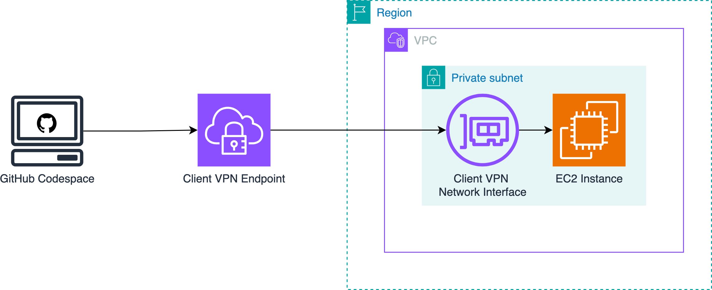
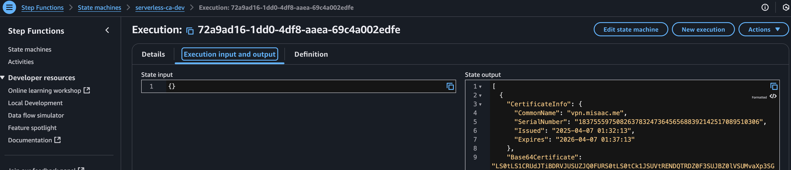

+++
title = "Creating an AWS Client VPN with Terraform and Serverless CA"
slug= "aws-client-vpn-terraform"
description = "Create a certificate-based AWS Client VPN without AWS Private CA"
date = "2025-04-11"
[taxonomies] 
tags = ["aws", "terraform", "vpn", "serverless-ca", "iac"]
+++

This post guides you through setting up [AWS Client VPN](https://aws.amazon.com/vpn/client-vpn/) using [Serverless CA](https://serverlessca.com/), a secure, cost-effective, open-source certifcate authority. 

## Problem Statement

You have resources in a private subnet in your AWS VPC - such as an EC2 instance, an RDS or Aurora database, or an MSK Kafka cluster - that are not publicly accessible. You'd like to access these resources from outside your VPC (e.g., from your laptop), without exposing them to the public internet.

## Solution

We'll setup an AWS Client VPN to enable you connect to the resources from anywhere. AWS Client VPN is a managed service, which means AWS handles the infrastructure and scaling, so you can focus on access and security.



We'll be connecting to a VPC with a private subnet and no internet gateway, A.K.A a **fully private** VPC. 

## Why use a Certificate Authority (CA)

AWS Client VPN supports several [authentication methods](https://docs.aws.amazon.com/vpn/latest/clientvpn-admin/client-authentication.html) , including mutual authentication (certificate-based), SAML, Active Directory (AD), or a combination of SAML/AD with certificates. For our setup, we’re choosing **certificate-based mutual authentication only**. 

The reasons for this choice are:
- **Headless access**: I want the ability to connect to the VPN without a GUI, for example, from environments like GitHub Codespaces. SAML requires a browser-based login flow, which doesn’t work well in headless or automated contexts.

- **Reusable CA foundation**: I plan to build on this CA for other identity and authentication use cases down the line, such as [AWS IAM Roles Anywhere](https://docs.aws.amazon.com/rolesanywhere/latest/userguide/introduction.html)


### Downsides to using only certificate-based auth with AWS Client VPN

When using only mutual authentication, you need to have a process for revoking access. AWS Client VPN supports [importing](https://docs.aws.amazon.com/vpn/latest/clientvpn-admin/cvpn-working-certificates.html) Certificate Revocation Lists (CRLs), but there is currently no Terraform resource for managing CRLs. As a result, you'll need to use either the AWS Management Console or the AWS CLI to manually update your Client VPN endpoint with the CRL. Fortunately, Serverless CA helps [automate](https://serverlessca.com/revocation/#enable-certificate-revocation) the certificate revocation process.

Mutual TLS authentication also has a limitation: it doesn’t support user group–based [authorization rules](https://docs.aws.amazon.com/vpn/latest/clientvpn-admin/cvpn-working-rules.html). This means you can’t assign different levels of network access to different users. To enable group-based access control, you’ll need to use federated authentication with SAML, Active Directory, or combine one of those with certificate authentication.

## Prerequisites

- Route 53 Zone (only required if you're going with public CRL)

- AWS VPC with a private subnet (i.e subnet with no route to an internet gateway)

- AWS resource that we'll be connecting to via the VPN, e.g. an EC2 instance


## Choosing a CA

While AWS offers a managed Certificate Authority through [AWS Private CA](https://docs.aws.amazon.com/privateca/latest/userguide/PcaWelcome.html), the version compatible with AWS Client VPN costs $400/month. There is a more affordable [$50/month option](https://aws.amazon.com/blogs/security/how-to-use-aws-private-certificate-authority-short-lived-certificate-mode/) that issues short-lived certificates, but I couldn’t get it working with Client VPN.

You can follow [these instructions](https://docs.aws.amazon.com/vpn/latest/clientvpn-admin/client-auth-mutual-enable.html) to manually create the required certificates using OpenVPN easy-rsa. However, if you ever need to revoke a certificate, you’ll need access to the original server used to issue it, or you must have securely stored the CA’s private key, certificate, certificate index, and serial file. These are required to generate a certificate revocation list (CRL) that AWS can use to block access.

Instead, we'll use the excellent [Serverless CA on AWS](https://serverlessca.com/) project. It’s an open-source CA with an IaC-based [revocation](https://serverlessca.com/revocation/) mechanism that's available as a Terraform [module](https://registry.terraform.io/modules/serverless-ca/ca/aws/latest) and  runs on AWS for roughly $50 per year.

### Setting up Serverless CA

Create a directory where we'll store our Terraform and other config. Throughout the rest of this post, we'll assume you're working from the root of this directory.

Serverless CA expects an AWS provider [alias](https://developer.hashicorp.com/terraform/language/providers/configuration#alias-multiple-provider-configurations) named `us-east-1` with region set to `us-east-1`. This is because certificates for CloudFront must be [created](https://docs.aws.amazon.com/AmazonCloudFront/latest/DeveloperGuide/cnames-and-https-requirements.html#https-requirements-certificate-issuer) in `us-east-1`. Although the CloudFront distribution only applies if you want to have a public CRL, the module requires you to pass one in regardless. 

Note that this doesn’t limit you to actually deploying the rest of Serverless CA to your preferred region. You’re free to configure an additional aws provider and point that to your desired AWS region.

```terraform
// Default provider for other resources
provider "aws" {
  region = "us-east-1"

}

// Specific provider required for optional CloudFront Certificate
provider "aws" {
  alias  = "us-east-1"
  region = "us-east-1"
}
```
 Make sure to specify both `issuing_ca_key_spec` and `root_ca_key_spec` as `RSA_2048`. This is necessary because in a future step, we'll want to add the generated certificates to AWS ACM and the default `ECC_NIST_P256` is [not supported](https://docs.aws.amazon.com/acm/latest/userguide/import-certificate-prerequisites.html) by ACM. 

Once your providers are setup, you can pass them to the CA module as shown below.

```terraform
module "certificate_authority" {
  source  = "serverless-ca/ca/aws"
  version = "1.8.0"

  providers = {
    aws           = aws
    aws.us-east-1 = aws.us-east-1
  }
  hosted_zone_domain  = "cert.misaac.me"
  hosted_zone_id      = aws_route53_zone.primary.zone_id
  public_crl          = true
  issuing_ca_key_spec = "RSA_2048"
  root_ca_key_spec    = "RSA_2048"
  env                 = "dev"
  cert_info_files     = ["tls", "revoked", "revoked-root-ca"]
  csr_files           = ["vpn.csr"]
}
```

If you'd like to customize your Root and Issuing CA certificate information, you can do so by modifying [root_ca_info](https://serverlessca.com/reference/#input_root_ca_info) and [issuing_ca_info](https://serverlessca.com/reference/#input_issuing_ca_info).

As for `cert_info_files` and `csr_files`, we'll be generating them in the next section.

<br>

### Generating a server certificate 

You can use Terraform to generate the server certificate via GitOps. The steps are:
- setup subdirectories and required files
- create and upload your CSR
- request the serverAuth extension for the server certificate
- run the generate certificate step function

Let's tackle these step-by-step.

#### Setup subdirectories and required files

Run the command below to create the required files and folders. Substitute `dev` with the environment you set when [instantiating](#setting-up-serverless-ca) Serverless CA.

```bash
mkdir -p certs/dev/csrs && \
for f in revoked-root-ca revoked tls; do \
  echo "[]" > certs/dev/$f.json; \
done
```

This should generate the files structure below.  At this point, each json file currently contains just an empty array `[]`.


```text
certs
└── dev
    ├── csrs
    ├── revoked-root-ca.json
    ├── revoked.json
    └── tls.json

3 directories, 3 files
```

#### Create Certificate Signing Request (CSR)

A Certificate Signing Request (CSR) is an encoded file that contains your public key along with information about your organization such as the domain name (Common Name), organization, country, and other metadata. It's submitted to a CA to request an SSL/TLS certificate. Let's use the Terraform `tls_cert_request` [resource](https://registry.terraform.io/providers/hashicorp/tls/latest/docs/resources/cert_request) to create our CSR. 

First, we need to generate our private key. I'm going to change directory and place this in `~/.ssh` so that we don't accidentally commit it.

```bash
openssl genrsa -out ~/.ssh/vpn.key 2048
```

Next, we'll populate the `tls_cert_request` resource and save the generated csr to the `csrs` directory using the `local_file` resource. Pass the private key using your preferred method, the `.tfvars` [method](https://developer.hashicorp.com/terraform/language/values/variables#variable-definitions-tfvars-files) or the `TF_VAR_server_cert_private_key` enviroment variable [method](https://developer.hashicorp.com/terraform/language/values/variables#environment-variables).

```terraform
variable "server_cert_private_key" {
  type      = string
  sensitive = true
}

resource "tls_cert_request" "server" {
  private_key_pem = chomp(var.server_cert_private_key)

  subject {
    common_name         = "vpn.misaac.me"
    organization        = "Serverless Inc"
    organizational_unit = "Security Operations"
    locality            = "London"
    province            = "England"
    country             = "GB"
  }

  dns_names = ["vpn.misaac.me"]
}

resource "local_file" "server_csr" {
  content  = tls_cert_request.server.cert_request_pem
  filename = "${path.module}/certs/dev/csrs/vpn.csr"
}
```
> **Note:** 
> By using the `tls_cert_request` resource, we are choosing to store our private key in the Terraform state file. You'll need to evaluate if this is appropriate for your security posture. If not, you should generate the CSR outside Terraform using `openssl` or another tool, and then pass only the CSR into Terraform.

**Run `terraform apply` twice**, first to generate the csr and save it to the `csrs` directory, and second to have the Serverless CA module pickup the just created csr and save it to the destination S3 bucket.

#### Request the serverAuth extension for the server certificate

By [default](https://serverlessca.com/client-certificates/#purposes), certificates issued by Serverless CA include only the **client authentication** [extension](https://docs.openssl.org/master/man5/x509v3_config/#extended-key-usage). To perform mutual authentication however, our vpn server certificate needs to have the server authentication extension. 

To achieve this, you'll need to modify `certs/dev/tls.json` and explicitly set the `server_auth` purpose. This updates the certificate's Extended Key Usage (EKU) to include `serverAuth`. You can also define other server-specific settings like lifetime before **running `terraform apply` twice**.

```json
[
    {
        "common_name": "vpn.misaac.me",
        "purposes": [
            "client_auth",
            "server_auth"
        ],
        "sans": [
            "vpn.misaac.me"
        ],
        "lifetime": 365,
        "csr_file": "vpn.csr"
    }
]
```
#### Run the certificate generation step function

Once applied, we need to run the CA Step Function. The Step Function will have a name similar to `serverless-ca-dev`, depending on the environment you set when [instantiating](#setting-up-serverless-ca) Serverless CA. For the input, use an empty JSON object by typing `{}` (curly braces).



Serverless CA will create the certificate based on the information in the CSR as well as the details entered in `certs/dev/tls.json`. Note that details entered in JSON e.g. Organization, Locality override those included in the CSR. 

On completion, click on the `Execution input and output` tab, and then copy the output json. 

### Adding the server certificate to ACM

To import the server certificate into ACM, we need the `private_key`, `certificate_body`, and the `certificate_chain`. We know the `private_key` as we [generated and supplied it](#create-certificate-signing-request-csr). As for the others, they are present in the output json we copied above. Add the variables `cert_body` and `cert_chain` using the values of the json keys `Base64Certificate` and  `Base64CaChain` respectively.

```terraform
variable "cert_body" {
  type      = string
  sensitive = true
}

variable "cert_chain" {
  type      = string
  sensitive = true
}
```

Then create your `aws_acm_certificate` resource.

```terraform
resource "aws_acm_certificate" "vpncert" {
  private_key       = chomp(var.server_cert_private_key)
  certificate_body  = base64decode(chomp(var.cert_body))
  certificate_chain = base64decode(chomp(var.cert_chain))
}
```
<br>

### Generating a client certificate 

Since we're performing mutual authentication, our GitHub Codespace will need its own certificate. Let's add the ability to generate client certificates to our Terraform. 

As noted earlier, consider generating the CSR outside Terraform using `openssl` or another tool, and then passing only the CSR into Terraform if you'd prefer to keep the private keys out of your Terraform state. Just make sure you save it in a secret/password manager as you'll need it later to connect. 

First, we'll create a variable to store the private key for our first vpn client.

```terraform
variable "client1_private_key_pem" {
  description = "PEM content of the private key for client1."
  type        = string
  sensitive   = true # <-- Mark the key content itself as sensitive
  # No default - this MUST be provided via environment variable
}
```
We'll generate that key using `openssl` as below and then pass it to Terraform at run time via an environment variable.

```bash
openssl genrsa -out ~/.ssh/client1.key 2048
```

Next, we'll set up a local variable that we can use for this and future client certificate requests.

```terraform
locals {
  # Construct the list using the injected variable and static data
  client_cert_requests = [
    {
      private_key_pem     = var.client1_private_key_pem
      common_name         = "client1.misaac.me"
      organization        = "Serverless Inc"
      organizational_unit = "Security Operations"
      locality            = "London"
      province            = "England"
      country             = "GB"
    },
    # If you had more clients, you'd define more variables (e.g., client2_private_key_pem)
    # and add corresponding objects to this list.
    # {
    #   private_key_pem = var.client2_private_key_pem
    #   common_name     = "client2.misaac.me"
    #   ...
    # }
  ]
}
```

Then we'll add the required resources. Note that we don't use the `aws_acm_certificate` resource here - unlike with the server certificate, importing the client certificates into ACM is optional. Similarly, we don't need to update `certs/dev/tls.json` as Serverless CA will create our client certificates with the `clientAuth` EKU by default.

```terraform
resource "tls_cert_request" "client_certs" {
  for_each        = { for cert in local.client_cert_requests : cert.common_name => cert }
  private_key_pem = chomp(each.value.private_key_pem)
  subject {
    common_name         = each.value.common_name
    organization        = each.value.organization
    organizational_unit = each.value.organizational_unit
    locality            = each.value.locality
    province            = each.value.province
    country             = each.value.country
  }
  dns_names = [each.value.common_name]

}

resource "local_file" "client_csrs" {
  for_each = { for cert in local.client_cert_requests : cert.common_name => cert }
  content  = tls_cert_request.client_certs[each.key].cert_request_pem
  filename = "${path.module}/certs/dev/csrs/${each.key}.csr"
}
```

Finally, we'll update the `csr_files` attribute to read all the csr files from our `client_cert_requests` variable.

```terraform
module "certificate_authority" {
  source  = "serverless-ca/ca/aws"
  version = "1.8.0"

  ...

  csr_files = concat(["vpn.csr"], [for cert in local.client_cert_requests : "${cert.common_name}.csr"])
}
```

Again, we'll **run `terraform apply` twice**, first to generate the csr and save it to the `csrs` directory, and second to have the Serverless CA module pickup the just created csr and save it to the destination S3 bucket.

Then go run the Step Function as we did for the server certificate. Again, copy and save the Step Function execution output into two files, one containing the private key, and the other containing the certificate. Note the paths as we'll be adding them to the vpn config later.
<br>

## Setting up Client VPN


To setup an AWS Client VPN endpoint, we need to :

- Set up logging
- Add a security group rule to allow access to your target resource
- Create the VPN endpoint
- Associate a target network
- Add an authorization rule

### Setting up logging

Connection logging records client connection requests, outcomes (success or failure), failure reasons, and client
termination time. Since we care about security, this observability is something we want to have.

```terraform
resource "aws_cloudwatch_log_group" "client_vpn" {
  name = "aws-client-vpn-logs"
}

resource "aws_cloudwatch_log_stream" "client_vpn" {
  name = "aws-client-vpn"
  log_group_name = aws_cloudwatch_log_group.client_vpn.name
}
```

### Add a security group rule to allow access to your target resource

If you create an AWS Client VPN endpoint without specifiying a security group, the VPC's default security group is
automatically applied to it.

AWS strongly recommends that default security groups restrict all inbound and outbound traffic, even though they cannot
be deleted. This is because inadvertently assigning a new AWS resource to the default security group can lead to
unauthorized access if it has open rules.

If your are following this best practice (which you should), you'll need to create a security group/security group rule
to allow access from the VPN to your target resource. Adjust the ingress rules (port, protocol) based on the resource
you need to access (e.g., port 5432 for PostgreSQL).

```terraform
resource "aws_security_group" "allow_ssh" {
  name = "allow_ssh"
  description = "Allow SSH inbound traffic and all outbound traffic"
  vpc_id = aws_vpc.main.id

  tags = {
  Name = "allow_ssh"
  }
}

resource "aws_vpc_security_group_ingress_rule" "allow_ssh_ipv4" {
  security_group_id = aws_security_group.allow_ssh.id
  cidr_ipv4 = aws_vpc.main.cidr_block
  from_port = 22
  ip_protocol = "tcp"
  to_port = 22
}
resource "aws_vpc_security_group_egress_rule" "allow_all_traffic_ipv4" {
  security_group_id = aws_security_group.allow_ssh.id
  cidr_ipv4 = "0.0.0.0/0"
  ip_protocol = "-1" # semantically equivalent to all ports
}
```
<br>

### Create the Client VPN Endpoint

This is the central resource you create and manage to enable secure connections between your remote users and your AWS
resources. It acts as the termination point for all client VPN sessions.

> **Note:**
> Take care to select a cidr range for your vpn endpoint that does not clash with the cidr range of your VPC.


```terraform
resource "aws_ec2_client_vpn_endpoint" "org" {
  description = "misaac.me VPN"
  server_certificate_arn = aws_acm_certificate.vpncert.arn
  client_cidr_block = "172.16.0.0/16"

  authentication_options {
  type = "certificate-authentication"
  root_certificate_chain_arn = aws_acm_certificate.vpncert.arn
  }

  connection_log_options {
  enabled = true
  cloudwatch_log_group = aws_cloudwatch_log_group.client_vpn.name
  cloudwatch_log_stream = aws_cloudwatch_log_stream.client_vpn.name
  }
  split_tunnel = true
  vpc_id = aws_vpc.main.id
  security_group_ids = [aws_security_group.allow_ssh.id]
}
```
Notice how we reference the server certificate issued which we previously imported into ACM in both
`server_certificate_arn` and `root_certificate_chain_arn`.

Since our client certificates will also be issued by the same CA, we can use the same certificate ARN as
the trust anchor for both server and client authentication. This allows any client certificate signed by the same CA to
be accepted during mutual TLS authentication.

We're also setting `split_tunnel` to `true`. This ensures that only traffic destined for resources inside the VPN is
routed through the VPN tunnel, while all other internet traffic continues to go through the user's local network.

If we left `split_tunnel` set to its default value of `false`, all traffic including internet-bound requests would be
routed through the VPN. Because the our fully-private VPC has no public internet access, this would effectively break
the user's connection, blackholing their traffic the moment they connect.

If you're reading this and you intend to set this up with an internet-connected vpc, note that `split_tunnel` might
still be useful for you if your security posture allows and you'd like to save on data transfer costs by only routing
AWS-bound traffic through the VPN.


### Associate the VPN endpoint with the VPC and subnet

To route VPN traffic into your VPC, you need to associate the endpoint with a **target network**. A target network is just a 
subnet in your VPC. This tells AWS where to send traffic from connected clients.

```terraform
resource "aws_ec2_client_vpn_network_association" "subnet_b" {
  client_vpn_endpoint_id = aws_ec2_client_vpn_endpoint.org.id
  subnet_id = aws_subnet.subnet_b.id
}
```
### Add an authorization rule for the VPC

Even after associating a subnet, clients can’t access anything yet. You need to explicitly allow it with an
authorization rule.

```terraform
resource "aws_ec2_client_vpn_authorization_rule" "subnet_b" {
  client_vpn_endpoint_id = aws_ec2_client_vpn_endpoint.org.id
  target_network_cidr = aws_vpc.main.cidr_block
  authorize_all_groups = true
}
```

<br>

## Connecting to Client VPN

To connect to the Client VPN, we'll need both the Client VPN endpoint configuration file and our generated client key
and certificate.

### Prepare the Client VPN endpoint configuration file
1. Open the Amazon VPC console at [https://console.aws.amazon.com/vpc/](https://console.aws.amazon.com/vpc/)

1. In the navigation pane, choose **Client VPN Endpoints**.

1. Select the Client VPN endpoint that was just created, and choose **Download client configuration**.

1. Open the Client VPN endpoint configuration file using your preferred text editor. Add `<cert></cert>` and `<key>
</key>` tags to the file. Place the contents of the client certificate and the contents of the private key between the
corresponding tags, as such:

```
<cert>
path to client certificate (.crt) file
</cert>

<key>
path to private key (.key) file
</key>
```
1. Save and close the Client VPN endpoint configuration file.

1. Add the line `pull-filter ignore "redirect-gateway"` to the ovpn file.

> **Note:** Step 6 deserves a bit of explanation. During testing on a local device using the AWS-provided VPN client, I
found that even though `split-tunnel` was enabled, AWS Client VPN was still routing all traffic through the VPN. The
culprit was the `redirect-gateway` flag which the AWS provided client was setting.
>
>Fortunately, `pull-filter` is one of the supported [OpenVPN
directives](https://docs.aws.amazon.com/vpn/latest/clientvpn-user/connect-aws-client-vpn-connect.html#support-openvpn)
in the AWS client. By adding `pull-filter ignore "redirect-gateway"`, we instruct the client to ignore that directive
and preserve split-tunnel behavior.

### Connect to the Client VPN endpoint

How you'll connect to the VPN depends on your OS as well as your VPN client. AWS provides its own [custom OpenVPN
client](https://docs.aws.amazon.com/vpn/latest/clientvpn-user/user-getting-started.html#install-client) that is designed
to be compatible with all features of AWS Client VPN. However, since the goal was to use this in an Ubuntu Linux GitHub
Codespace, we'll just use the bog standard OpenVPN client.

First we'll install openvpn.
```
sudo apt-get update && sudo apt-get install openvpn
```

Then we can connect using:

```
sudo openvpn --config /path/to/config/file
```


If all went well, you should see this:

```text
@mbuotidem ➜ /workspaces/mbuotidem.github.io (main) $ sudo openvpn --config o.ovpn
Sat Apr 12 00:40:17 2025 OpenVPN 2.4.12 x86_64-pc-linux-gnu [SSL (OpenSSL)] [LZO] [LZ4] [EPOLL] [PKCS11] [MH/PKTINFO]
[AEAD] built on Jun 27 2024
Sat Apr 12 00:40:17 2025 library versions: OpenSSL 1.1.1f 31 Mar 2020, LZO 2.10
Sat Apr 12 00:40:17 2025 TCP/UDP: Preserving recently used remote address: [AF_INET]3.XXX.XXX.72:443
Sat Apr 12 00:40:17 2025 Socket Buffers: R=[1048576->1048576] S=[212992->212992]
...

Sat Apr 12 00:40:19 2025 Outgoing Data Channel: Cipher 'AES-256-GCM' initialized with 256 bit key
Sat Apr 12 00:40:19 2025 Incoming Data Channel: Cipher 'AES-256-GCM' initialized with 256 bit key
Sat Apr 12 00:40:19 2025 ROUTE_GATEWAY 10.0.0.1/255.255.0.0 IFACE=eth0 HWADDR=7c:1e:52:5b:bf:9b
Sat Apr 12 00:40:19 2025 TUN/TAP device tun0 opened
Sat Apr 12 00:40:19 2025 TUN/TAP TX queue length set to 100
Sat Apr 12 00:40:19 2025 /sbin/ip link set dev tun0 up mtu 1500
Sat Apr 12 00:40:19 2025 /sbin/ip addr add dev tun0 172.16.0.13/27 broadcast 172.16.0.31
Sat Apr 12 00:40:19 2025 /sbin/ip route add 172.31.0.0/16 via 172.16.0.1
Sat Apr 12 00:40:19 2025 Initialization Sequence Completed
```

You can now leave that terminal window running, open a new one, and ssh, curl, or otherwise connect to the resource in your private subnet!

### Wrapping Up

That’s it! You now have a fully functional, certificate-based AWS Client VPN without having to pay AWS Private CA’s hefty price tag. By using Serverless CA, we’ve built a scalable, revocable, IaC-backed certificate authority that runs for under $50 a year. 

From here, we can layer on additional access controls, integrate with IAM Roles Anywhere, or extend the same CA for other use cases.

You’ll still need to pay for the [AWS VPN](https://aws.amazon.com/vpn/pricing/) itself including the hourly charge for the VPN endpoint (even when idle), plus any connection and data transfer fees. But at least you're not spending $400/month just to run a CA.


<!-- https://aws.amazon.com/blogs/security/connect-your-on-premises-kubernetes-cluster-to-aws-apis-using-iam-roles-anywhere/ -->