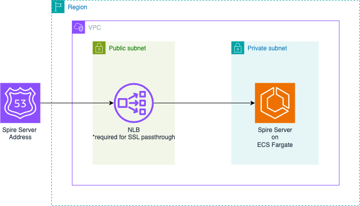

+++
title = "Grant AWS Access to GitHub Codespaces via SPIFFE/SPIRE & IAM Roles Anywhere"
slug = "grant-aws-access-to-codespaces-via-spiffe-spire-iam-roles-anywhere"
description = "Learn how to authenticate your GitHub Codespace to AWS using SPIRE-issued X.509 certificates and AWS IAM Roles Anywhere"
date = "2025-05-19"
[taxonomies] 
tags = [
  "spiffe/spire",
  "identity",
  "secrets management",
  "zero trust",
  "aws",
  "codespaces",
  "iam",
  "terraform",
  "github",
  "iac"
]

+++

## Preamble

In our [intro post](https://misaac.me/blog/spiffe-spire-secret-sprawl-fix/), we discussed why [SPIFFE/SPIRE](https://spiffe.io/) might just be the right identity foundation for your org. SPIFFE is the open standard, while SPIRE is the reference implementation. 

As a refresher, SPIFFE/SPIRE solves the secret zero problem, namely, how do I securely bootstrap trust of a workload, without first giving it a secret? SPIFFE does this by requiring that implementations provide a mechanism for workloads to request an x.509 certificate using only properties that are inherently available in the environment the workload is running on. 


To acheive this securely, SPIRE has both workloads and the nodes they run on  perform [attestation](https://spiffe.io/docs/latest/spire-about/spire-concepts/#attestation) using out-of-band authenticity checks. In other words, it checks that a workload **is truly running** on the environment it claims by verifying platform-specific properties such as AWS instance metadata, Kubernetes service account tokens, or other environment specific metadata it can obtain. Its like having a cool friend that gets you on the guest list at a hard to enter club in Berlin - the workload just has to show up as itself, and if its on the list, it'll get the certificate. 


In this post, we'll be focusing on one possible use case - letting our GitHub Codespace environments authenticate to AWS via AWS IAM Roles Anywhere. 

<br>

## Terminology

Here's a brief guide to key terms used in this post:

**SPIFFE (Secure Production Identity Framework for Everyone):** A universal standard for securely issuing identities to workloads, enabling them to prove their identity without managing traditional secrets.

**SPIRE (SPIFFE Runtime Environment):** An open-source implementation of SPIFFE, responsible for issuing identities to workloads and verifying their authenticity.

**PKI (Public Key Infrastructure):** A system used for generating, managing, distributing, and revoking digital certificates and associated cryptographic keys.

**mTLS (Mutual TLS):** A variation of the Transport Layer Security (TLS) protocol, requiring both the client and server to verify each other's identity through cryptographic certificates.

**IAM Roles Anywhere:** An AWS service that extends AWS Identity and Access Management (IAM) roles to workloads running outside AWS environments, enabling secure and temporary credential generation based on external certificates.

**Attestation:** The cryptographic process used to verify that a workload or node truly is what it claims to be, often by validating metadata provided by cloud providers or system environments.

**SVID (SPIFFE Verifiable Identity Document):** A short-lived, cryptographically verifiable certificate or token containing a unique SPIFFE ID, used by workloads to securely authenticate their identity.

**Node Attestation:** A secure procedure used by SPIRE to confirm the identity of nodes (e.g., servers, virtual machines, or containers) before issuing credentials.

**Workload Attestation:** A process where SPIRE verifies the identity of an individual workload, typically by inspecting attributes like Unix user IDs, Kubernetes service accounts, or other environment-specific metadata.

**Trust Anchor:** A trusted entity, such as a root certificate authority, used as a starting point in establishing cryptographic trust chains. When a CA is a trust anchor, it means that a system can trust the CA to sign certificates that it can, in turn, trust.

**Selector:** Attributes defined in SPIRE registration entries used to recognize and verify workloads, such as Unix user IDs or Kubernetes labels.

<br>

## What's our goal?

Our goal is gain access to AWS from our GitHub Codespace using a SPIRE issued X.509 certificate, also known as [SVIDs](https://spiffe.io/docs/latest/spire-about/spire-concepts/#a-day-in-the-life-of-an-svid). To do this, we will :

- set up our PKI
- set up IAM Roles Anywhere
- set up a SPIRE Server on AWS that will register itself with IAM Roles Anywhere
- fire up a local SPIRE agent to listen for SPIFFE SVID x.509 certificate requests
- request a certificate (SVID)
- use that certificate to obtain AWS credentials via IAM Roles Anywhere

## Setting up our Public Key Infrastructure (PKI)

By default, the SPIRE server can act as its own certificate authority. However because we want to use this SPIRE server as our universal identity control plane, we will instead set it up to use our own PKI system as this will help support future integrations. Through its robust plugin system, SPIRE lets us set our own `UpstreamAuthority`. Let's spin up a quick-and-dirty PKI using Terraform. 

```
# 1. Root CA Private Key
resource "tls_private_key" "root_ca_key" {
  algorithm = "RSA"
  rsa_bits  = 2048
}

# 2. Root CA Self-Signed Certificate
resource "tls_self_signed_cert" "root_ca_cert" {
  private_key_pem = tls_private_key.root_ca_key.private_key_pem

  subject {
    common_name  = "misaac.me Root CA"
    organization = "Misaac Org"
    country      = "US"
  }

  is_ca_certificate = true
  validity_period_hours = 87600 # 10 years

  allowed_uses = [
    "cert_signing",
    "crl_signing",
    "key_encipherment",
    "digital_signature",
  ]

}
```

Next we'll store this information in AWS Secret Manager as its one of the available `UpstreamAuthority` sources [supported by SPIRE](https://github.com/spiffe/spire/blob/v1.12.0/doc/plugin_server_upstreamauthority_awssecret.md). 

```
resource "aws_secretsmanager_secret" "upstream_authority_cert_file" {
  name                    = "spire_cert_file"
  recovery_window_in_days = 0
}

resource "aws_secretsmanager_secret_version" "upstream_authority_cert_file" {
  secret_id                = aws_secretsmanager_secret.upstream_authority_cert_file.id
  secret_string_wo         = tls_self_signed_cert.root_ca_cert.cert_pem
  secret_string_wo_version = 12
}

resource "aws_secretsmanager_secret" "upstream_authority_key_file" {
  name                    = "spire_key_file"
  recovery_window_in_days = 0
}

resource "aws_secretsmanager_secret_version" "upstream_authority_key_file" {
  secret_id                = aws_secretsmanager_secret.upstream_authority_key_file.id
  secret_string_wo         = tls_private_key.root_ca_key.private_key_pem
  secret_string_wo_version = 12
}
```
Using Terraform as your PKI will likely not win you security awards, and if you don't already have a production grade PKI, you can always use AWS ACM Private Certificate Authority via the [`aws_pca`](https://github.com/spiffe/spire/blob/v1.12.0/doc/plugin_server_upstreamauthority_aws_pca.md) plugin. 

It is worth mentioning however that AWS PCA costs at minimum [$400 a month](https://aws.amazon.com/private-ca/pricing/) unless you use the short-lived certificate mode. And while the short-lived certificate mode does work with SPIRE, you need to make sure that your scenarios support certificates with such a short (7 days) validity period. For example, AWS Client VPN, one of the services we intend to support, [doesn't](https://repost.aws/questions/QUJNVBimQVQjW7L7DHRFaxQQ#ANzORcy-x6RcaVWg2gqeLZUA). 

<br>

## Setting up IAM Roles Anywhere

To use IAM Roles Anywhere, we need a configured trust anchor, an IAM role that will be assumed, and an IAM Roles Anywhere profile. Notice how we set `source_data` to the root cert of our PKI, but then add an `ignore_changes` directive. That's because once our SPIRE server is setup, it will update the trust anchor to point to the SPIRE intermediate CA it creates. When a workload requests AWS credentials, IAM Roles Anywhere will check if the workload's X.509 certificate was issued by our SPIRE server, i.e signed by SPIRE's intermediate CA. If so, IAM Roles Anywhere provides the credentials. 

```
resource "aws_rolesanywhere_trust_anchor" "iamra" {
  name = "spire-trust-anchor"
  source {
    source_data {
      x509_certificate_data = tls_self_signed_cert.root_ca_cert.cert_pem
    }
    source_type = "CERTIFICATE_BUNDLE"
  }
  lifecycle {
    ignore_changes = [source[0].source_data[0].x509_certificate_data]
  }
  enabled = true
}

resource "aws_iam_role" "iamra" {
  name = "iamra"
  path = "/"

  assume_role_policy = jsonencode({
    Version = "2012-10-17"
    Statement = [{
      Action = [
        "sts:AssumeRole",
        "sts:TagSession",
        "sts:SetSourceIdentity"
      ]
      Principal = {
        Service = "rolesanywhere.amazonaws.com",
      }
      Effect = "Allow"
      Sid    = ""
    }]
  })
}

resource "aws_rolesanywhere_profile" "iamra" {

  name      = "example"
  role_arns = [aws_iam_role.iamra.arn]
  enabled   = true
}
```

Note that we don't grant this IAM role any permissions at this time. So the most we'll be able to do with it once assumed is run `aws-get-caller-identity`. But that's sufficient for us to verify that our plumbing works.

<br>

## Setting up the SPIRE Server
While most people running SPIRE will likely be running it on Kubernetes, for the purposes of this series, we'll keep things simple and use ECS.

### Architecture

 Below is our proposed setup:



Here's how the solution works :
1. A Route 53 record holds the address that SPIRE agents will reach the SPIRE server on
1. The Route 53 record will point to a Network Load Balancer (NLB) deployed in our public subnet
1. This Network Load Balancer routes traffic to the SPIRE server hosted on an ECS Fargate service in a private subnet

We choose a Network Load Balancer to allow for SSL passthrough as this is required for the SPIRE server and agent to complete their mTLS handshake. 

### Prerequisites
The terraform code below assumes the existence of the following: 
- AWS VPC with both public and private subnets
- A Route 53 hosted zone

### Setting up Route53 and the Network Load Balancer
Pick a name for your record and then make sure you choose `network` as the load balancer type and `ip` as the target group listener `target_type`.

```
resource "aws_route53_record" "alb" {
  zone_id = aws_route53_zone.primary.zone_id
  name    = "spire.misaac.me"
  type    = "A"

  alias {
    name                   = module.alb.dns_name
    zone_id                = module.alb.zone_id
    evaluate_target_health = true
  }
}

module "alb" {
  source  = "terraform-aws-modules/alb/aws"
  version = "9.16.0" # Latest version as of April 2025

  name = "misaac-me-alb"

  load_balancer_type = "network"
  vpc_id             = aws_vpc.main.id
  subnets            = [aws_subnet.public_subnet_a.id, aws_subnet.public_subnet_b.id]
  security_groups    = [aws_security_group.alb_sg.id]


  listeners = {
    alb_listener = {
      port     = 8081
      protocol = "TCP"
      forward = {
        target_group_key = "spire_ip"
      }
    }

  }

  target_groups = {
    spire_ip = {
      name                 = "misaac-me-tg"
      port                 = 8081
      protocol             = "TCP"
      target_type          = "ip"
      deregistration_delay = 5
      create_attachment    = false
    }

  }
}
```
<br>

### Setting up our ECS Service

#### The cluster
First, we create our cluster. We'll be taking advantage of community modules from the invaluable [Terraform AWS modules](https://github.com/terraform-aws-modules) project. 

```

module "ecs" {
  source  = "terraform-aws-modules/ecs/aws"
  version = "5.12.1" # Latest version as of April 2025

  cluster_name = "misaac-me-cluster"

  # Capacity providers
  fargate_capacity_providers = {
    FARGATE = {
      default_capacity_provider_strategy = {
        weight = 100
      }
    }
  }

}
```
<br>


#### The log groups and IAM roles

Next, we set up the log groups and IAM Roles that our task will need. Nothing revolutionary here, we use the managed policies and allow ECS access to perform actions on our behalf. 
```
# CloudWatch Logs Group for ECS Task
resource "aws_cloudwatch_log_group" "spire" {
  name              = "/ecs/misaac-me-spire"
  retention_in_days = 30

}

# IAM Role for ECS Task Execution
resource "aws_iam_role" "ecs_execution_role" {
  name = "ecs-execution-role"

  assume_role_policy = jsonencode({
    Version = "2012-10-17"
    Statement = [
      {
        Action = "sts:AssumeRole"
        Effect = "Allow"
        Principal = {
          Service = "ecs-tasks.amazonaws.com"
        }
      }
    ]
  })

}

# Attach required policies for ECS Task Execution Role
resource "aws_iam_role_policy_attachment" "ecs_execution_role_policy" {
  role       = aws_iam_role.ecs_execution_role.name
  policy_arn = "arn:aws:iam::aws:policy/service-role/AmazonECSTaskExecutionRolePolicy"
}

# IAM Role for ECS Task
resource "aws_iam_role" "ecs_task_role" {
  name = "ecs-task-role"

  assume_role_policy = jsonencode({
    Version = "2012-10-17"
    Statement = [
      {
        Action = "sts:AssumeRole"
        Effect = "Allow"
        Principal = {
          Service = "ecs-tasks.amazonaws.com"
        }
      }
    ]
  })

}
```
<br>


#### The IAM Policies

With our roles setup, we can define the IAM policies that should be attached, namely: 
1. Grant our SPIRE server read access to the PKI info we stored in AWS secret manager
1. Grant our SPIRE server read access to AWS Parameter Store to read its config (we'll set this up later in the post)
1. Set permissions to allow for [ECS Exec](https://docs.aws.amazon.com/AmazonECS/latest/developerguide/ecs-exec.html) as we'll be using this to run some SPIRE server commands. 
1. Grant our SPIRE server the ability to update an AWS IAM Roles Anywhere trust anchor. 

```
# ECS Task policy for reading configuration
resource "aws_iam_policy" "spire_server_policy" {
  name        = "spire-server-policy"
  description = "Allow reading from Secret Manager"

  policy = jsonencode({
    Version = "2012-10-17"
    Statement = [
      {
        Action = [
          "ssm:GetParameter*",
        ]
        Effect   = "Allow"
        Resource = "arn:aws:ssm:us-east-1:*:parameter/misaac-me/*"
      },
      {
        "Effect" : "Allow",
        "Action" : [
          "ssmmessages:CreateControlChannel",
          "ssmmessages:CreateDataChannel",
          "ssmmessages:OpenControlChannel",
          "ssmmessages:OpenDataChannel"
        ],
        "Resource" : "*"
      },
      {
        "Sid" : "IAMRolesAnywhere",
        "Effect" : "Allow",
        "Action" : [
          "rolesanywhere:UpdateTrustAnchor",
        ],
        "Resource" : "*"
      },
      {
        "Sid": "ReadSpecificSecrets",
        "Effect": "Allow",
        "Action": [
          "secretsmanager:GetSecretValue",
          "secretsmanager:DescribeSecret"
        ],
        "Resource": [
            aws_secretsmanager_secret.upstream_authority_cert_file.arn,
            aws_secretsmanager_secret.upstream_authority_key_file.arn,
          ]
      }

    ]
  })
}

# Attach the Parameter Store policy to the task role
resource "aws_iam_role_policy_attachment" "task_parameter_store" {
  role       = aws_iam_role.ecs_task_role.name
  policy_arn = aws_iam_policy.parameter_store_read.arn
}
```

<br>

#### The SPIRE Server Config

Before we setup the ECS Task definition that will run our SPIRE Server, we need to populate our SPIRE server configuration file. The SPIRE documentation provides a [handy reference](https://spiffe.io/docs/latest/deploying/spire_server/) which goes into detail regarding all the knobs available. SPIRE is built to be readily extensible and has a thriving [plugin ecosystem](https://spiffe.io/docs/latest/planning/extending/).  

We'll make use of a number of plugins below, and set up our config as a terraform template file, so we can interpolate our `UpstreamAuthority` and AWS IAM Roles Anywhere trust anchor. For our purposes, the following settings and plugins shall suffice:

```
# server.conf.tftpl
server {
    bind_address = "0.0.0.0"
    bind_port = "8081"
    socket_path = "/tmp/spire-server/private/api.sock"
    trust_domain = "misaac.me"
    data_dir = "./.data"
    log_level = "DEBUG"
    ca_key_type = "rsa-2048"
    ca_subject {
        country = ["US"]
        organization = ["SPIRE"]
        common_name = "misaacspireissued"
    }
}

plugins {
    DataStore "sql" {
        plugin_data {
            database_type = "sqlite3"
            connection_string = "./.data/datastore.sqlite3"
        }
    }

    NodeAttestor "join_token" {
        plugin_data {
        }
    }

    KeyManager "disk" {
        plugin_data {
            keys_path = "/tmp/spire-server/private/keys.json"
        }
    }

    UpstreamAuthority "awssecret" {
        plugin_data {
            region = "us-east-1",
            # Use template variables for ARNs
            cert_file_arn = "${cert_arn}",
            key_file_arn = "${key_arn}"        }
    }

    BundlePublisher "aws_rolesanywhere_trustanchor" {
    plugin_data {
        region = "us-east-1"
        trust_anchor_id = "${trust_anchor_id}"
    }
}
}

health_checks {
    listener_enabled = true
    bind_address = "0.0.0.0"
    # bind_port = "80" # Default is 80, uncomment if needed
}
```

We store this config file as an AWS SSM Parameter and we'll load in into a volume attached to our SPIRE server during our ECS task startup. 

```
resource "aws_ssm_parameter" "server_config" {
  name        = "/misaac-me/server-config"
  description = "SPIRE server configuration for misaac.me"
  type        = "SecureString"
  value = templatefile("${path.module}/server.conf.tftpl", {
    cert_arn = aws_secretsmanager_secret.upstream_authority_cert_file.arn
    key_arn  = aws_secretsmanager_secret.upstream_authority_key_file.arn
    trust_anchor_id = aws_rolesanywhere_trust_anchor.iamra.id
  })

}
```

Its worth pointing out a few technical choices made. One is to set `ca_key_type` to 2048. This ensures that the keys we're issued are compatible with the largest swath of AWS services we'd like to integrate in the future. For example, AWS Client VPN endpoints [only](https://docs.aws.amazon.com/vpn/latest/clientvpn-admin/mutual.html) support 1024-bit and 2048-bit RSA key sizes. 

Another is the choice of sql lite as our data store. In a production environment, you'd certainly want to use a managed database via the [`sql`](https://github.com/spiffe/spire/blob/v1.12.0/doc/plugin_server_datastore_sql.md) plugin. 

Similarly, we use the disk `KeyManager` which means a set of private keys are persisted to disk. In a production enviroment, you'd also want to switch over to using the [`aws_kms`](https://github.com/spiffe/spire/blob/v1.12.0/doc/plugin_server_keymanager_aws_kms.md) key manager plugin instead which ensures your private key never leaves KMS. 

<br>

#### The SPIRE Server ECS Task Definition

As mentioned earlier, we will need to provide the SPIRE server the config file. We create a shared config volume where we will place the config and attach both our init container and the SPIRE server container to it. We use the [aws-cli](https://hub.docker.com/r/amazon/aws-cli) docker image as our init container's image and instruct it to fetch the SPIRE server config and save it to the volume. When starting the SPIRE server up, we pass it the location of the config file, so it can initialize properly. 

```
resource "aws_ecs_task_definition" "spire" {
  family                   = "misaac-me-spire"
  requires_compatibilities = ["FARGATE"]
  network_mode             = "awsvpc"
  cpu                      = 256
  memory                   = 512
  execution_role_arn       = aws_iam_role.ecs_execution_role.arn
  task_role_arn            = aws_iam_role.ecs_task_role.arn

  # Add volume for sharing configuration between containers
  volume {
    name = "config-volume"
  }

  container_definitions = jsonencode([
    {
      name       = "config-init"
      image      = "amazon/aws-cli:latest"
      essential  = false
      entryPoint = ["sh", "-c"]

      command = [
        <<-EOF
          set -e
          echo "Ensuring target directory exists on volume..."
          mkdir -p /opt/spire/conf/server

          echo "Fetching SPIRE server config..."
          aws ssm get-parameter --name "/misaac-me/server-config" --with-decryption --query "Parameter.Value" --output text > /opt/spire/conf/server/server.conf

          echo "All configuration files fetched successfully to the shared volume."
        EOF
      ]


      logConfiguration = {
        logDriver = "awslogs"
        options = {
          "awslogs-group"         = aws_cloudwatch_log_group.spire.name
          "awslogs-region"        = "us-east-1"
          "awslogs-stream-prefix" = "config-init"
        }
      }

      mountPoints = [
        {
          sourceVolume  = "config-volume"
          containerPath = "/opt/spire/conf/server"
          readOnly      = false
        }
      ]
    },
    {
      name      = "app"
      image     = "ghcr.io/spiffe/spire-server:nightly"
      essential = true
      dependsOn = [
        {
          containerName = "config-init"
          condition     = "SUCCESS"
        }
      ]

      # Command to run SPIRE server with our config
      command = [
        "sh",
        "-c",
        "mkdir -p /tmp/spire-server/private && chmod 777 /tmp/spire-server/private && spire-server run --config /opt/spire/conf/server/server.conf"
      ]

      environment = [

      ]
      user = "0"
      linuxParameters = {
        initProcessEnabled = true
      }

      portMappings = [
        {
          # Update port mapping to use SPIRE server port from config
          containerPort = 8081
          hostPort      = 8081
          protocol      = "tcp"
        },
        {
          # Update port mapping to use SPIRE server port from config
          containerPort = 80
          hostPort      = 80,
          protocol      = "tcp"
        }
      ]

      mountPoints = [
        {
          sourceVolume  = "config-volume"
          containerPath = "/opt/spire/conf/server"
          readOnly      = true
        },
        {
          sourceVolume  = "config-volume"
          containerPath = "/tmp/spire-server/private"
          readOnly      = false
        }
      ]

      logConfiguration = {
        logDriver = "awslogs"
        options = {
          "awslogs-group"         = aws_cloudwatch_log_group.spire.name
          "awslogs-region"        = "us-east-1"
          "awslogs-stream-prefix" = "spire"
        }
      }
    }
    
  ])

  depends_on = [aws_secretsmanager_secret.upstream_authority_cert_file, aws_secretsmanager_secret.upstream_authority_key_file, aws_secretsmanager_secret.upstream_authority_bundle_file]
}
```

<br>

#### The security groups

We need to set up the rules for traffic flow. Below, we allow SPIRE traffic into the ALB, and allow traffic from the ALB to our ECS task. We also allow the usual 80 and 443 ports (these are useful if we decide to setup healtchecks in the future), as well as outbound traffic to anywhere.

```
# Security group for ALB
resource "aws_security_group" "alb_sg" {
  name        = "alb-security-group"
  description = "Allow HTTP and HTTPS inbound traffic for ALB"
  vpc_id      = aws_vpc.main.id

  tags = {
    Name = "alb-sg"
  }
}

resource "aws_vpc_security_group_ingress_rule" "allow_spire" {
  security_group_id = aws_security_group.alb_sg.id
  cidr_ipv4         = "0.0.0.0/0"
  from_port         = 8081
  ip_protocol       = "tcp"
  to_port           = 8081
}

resource "aws_vpc_security_group_ingress_rule" "allow_http" {
  security_group_id = aws_security_group.alb_sg.id
  cidr_ipv4         = "0.0.0.0/0"
  from_port         = 80
  ip_protocol       = "tcp"
  to_port           = 80
}

resource "aws_vpc_security_group_ingress_rule" "allow_https" {
  security_group_id = aws_security_group.alb_sg.id
  cidr_ipv4         = "0.0.0.0/0"
  from_port         = 443
  ip_protocol       = "tcp"
  to_port           = 443
}

resource "aws_vpc_security_group_egress_rule" "alb_allow_all_outbound" {
  security_group_id = aws_security_group.alb_sg.id
  cidr_ipv4         = "0.0.0.0/0"
  ip_protocol       = "-1"
}

# Security group for ECS tasks
resource "aws_security_group" "ecs_tasks_sg" {
  name        = "ecs-tasks-security-group"
  description = "Allow inbound traffic from ALB to ECS tasks"
  vpc_id      = aws_vpc.main.id

  tags = {
    Name = "ecs-tasks-sg"
  }
}

resource "aws_vpc_security_group_ingress_rule" "allow_alb_to_ecs" {
  security_group_id            = aws_security_group.ecs_tasks_sg.id
  referenced_security_group_id = aws_security_group.alb_sg.id
  from_port                    = 8081
  ip_protocol                  = "tcp"
  to_port                      = 8081
}

resource "aws_vpc_security_group_egress_rule" "ecs_allow_all_outbound" {
  security_group_id = aws_security_group.ecs_tasks_sg.id
  cidr_ipv4         = "0.0.0.0/0"
  ip_protocol       = "-1"
}
```
<br>


#### The ECS Service

We place our service in our private subnets, and assign it the ecs security group we created above. The other key thing here is that we reference the target group, `spire_ip` which we created earlier in the [route 53/load balancer](#setting-up-route53-and-the-network-load-balancer) section. This tells ECS to wire the task up to that listener once it is ready to receive requests. We also set up our terraform to redeploy this service anytime we run a new apply with a redeployment trigger. This is optional but proved utterly useful while iterating on this. 

```
resource "aws_ecs_service" "spire" {
  name                   = "misaac-me-spire"
  cluster                = module.ecs.cluster_id
  task_definition        = aws_ecs_task_definition.spire.arn
  desired_count          = 1
  launch_type            = "FARGATE"
  enable_execute_command = true

  network_configuration {
    subnets         = [aws_subnet.subnet_a.id, aws_subnet.subnet_b.id]
    security_groups = [aws_security_group.ecs_tasks_sg.id]
  }

  load_balancer {
    target_group_arn = module.alb.target_groups["spire_ip"].arn
    container_name   = "app"
    container_port   = 8081
  }

  depends_on = [module.alb]

  force_new_deployment = true

  triggers = {
    redeployment = plantimestamp()
  }
}
```

<br>

### Verifiying the deployment

After hitting `terraform plan` and `terraform apply`, head over to your the ECS page on AWS and drill down into the now running task. Select the logs tab to view the startup logs. Because we set the log level to `DEBUG` in our [server config](#the-spire-server-config), you'll see detailed startup information as the SPIRE server tries to setup all the plugins we enabled. 

The best way to be sure things are all good to go however is to run the health check command. For this and further interactions with the SPIRE server, we'll rely on the ECS Exec functionality that we enabled. Grab the ECS task ID and run the healtcheck command. You should see output similar to below. 

```

$ aws ecs execute-command --cluster misaac-me-cluster \
    --task 7a1c81dd127448f6aad9b9c8064efa54 \
    --container app \
    --interactive \
    --command "/opt/spire/bin/spire-server healthcheck"

The Session Manager plugin was installed successfully. Use the AWS CLI to start a session.


Starting session with SessionId: ecs-execute-command-dztjl3tojo6pgpcv5be5vs42x8
Server is healthy.


Exiting session with sessionId: ecs-execute-command-dztjl3tojo6pgpcv5be5vs42x8.
```

The line **Server is healthy** indicates that we're good to go. At this point, we are ready to try to get an SVID. For this, we'll need to setup the SPIRE agent.

<br>

## Setting up the SPIRE Agent
Follow the instruction on [Quickstart for Linux and MacOSX](https://spiffe.io/docs/latest/try/getting-started-linux-macos-x/) to install the SPIRE Agent on your device. If you're on Windows, you can find Windows binaries for SPIRE on the [GitHub Releases page](https://github.com/spiffe/spire/releases). The SPIRE team [has worked hard](https://www.cncf.io/blog/2022/05/18/spire-now-runs-on-windows/) to ensure the user experience is consistent accross platforms so the rest of the instructions should work as described. 

### The Agent Config

Just like the server, the SPIRE agent needs a config file to tell it how to run. Here's an example where we provide the SPIRE server address the agent should use, as well as set it up to attest using a join token. The SPIRE agent expects this config to be located at `./conf/agent/agent.conf`.

Another production note is that below, we set the `insecure_bootstrap` flag. Insecure bootstrap is **NOT** appropriate for production use. We only use it here to make things slightly easier as we evaluate. To turn this off and connect the ideal way remove the `insecure_bootstrap` line, provide your agent with the CA trust bundle, placing it in the same location as the config file, and uncomment the `trust_bundle_path` line. With the bundle, the SPIRE agent will verify the server chain, rather than perform just the soft verification of the server URI. 

```
agent {
    data_dir = "./.data"
    log_level = "DEBUG"
    server_address = "spire.misaac.me"
    server_port = "8081"
    socket_path ="/tmp/spire-agent/public/api.sock"
    # trust_bundle_path = "./conf/agent/dummy_root_ca.crt"
    trust_domain = "misaac.me"
    insecure_bootstrap = true
}

plugins {
    NodeAttestor "join_token" {
        plugin_data {
        }
    }
    KeyManager "disk" {
        plugin_data {
            directory = "./.data"
        }
    }
    WorkloadAttestor "unix" {
        plugin_data {
        }
    }
}
```
<br>

### Node Attestation with a join token

With your agent installed, and your agent config all set up, our next step is to request a [join token](https://spiffe.io/docs/latest/deploying/configuring/#join-token) from the SPIRE server. This will allow us to prove our agents identity to the SPIRE server, a process known as [Node Attestation](https://spiffe.io/docs/latest/spire-about/spire-concepts/#node-attestation). Note that for your workloads running on cloud compute, you should prefer any of the other `NodeAttestor` [plugins](https://spiffe.io/docs/latest/deploying/spire_agent/#built-in-plugins) which use things like AWS instance identity or Kubernetes service tokens. 

You may be wondering, "hey, you told me that [no secrets](#preamble) are required!" And you're right to wonder - a join token does technically function as a secret during the initial bootstrapping of the SPIRE Agent. 

Note however, that our argument was that the **workload** does not need to hold a secret. Remember, that with a traditional secret such as an API key, database password, TLS private key or other long-lived credential, the problem is in their lifecycle and distribution. They need to be provisioned **to** the workload **before** it can authenticate - which is what leads to the "secret zero problem" - how do you securely get that first secret to the workload? 

Our join token however is ***not*** held by the workload. The *workload itself*, (i.e a specific application instance running in a pod or VM) does not possess this join token. Instead, the SPIRE Agent does, and only uses it for its **initial** authentication to the SPIRE server. Also, unlike most secrets, the join token expires immediately after use and is only used by the agent to perform node attestation. 

The key takeway then is the shift in trust boundary. Instead of each individual workload needing a unique, pre-provisioned secret, you now have a controlled, temporary secret, (the join token), that is used *once* by the SPIRE agent to establish a secure channel to the SPIRE server. This shifts the "secret zero" problem from potentially thousands of workloads to a single, tightly controlled initial authentication for the SPIRE agent. 

Here's the command to run, and the output to expect. 

```

$ aws ecs execute-command --cluster misaac-me-cluster \
    --task 7a1c81dd127448f6aad9b9c8064efa54 \
    --container app \
    --interactive \
    --command "/opt/spire/bin/spire-server token generate -spiffeID spiffe://misaac.me/myagent"

The Session Manager plugin was installed successfully. Use the AWS CLI to start a session.


Starting session with SessionId: ecs-execute-command-gg5fgucsodxjrjz5netervpkce
Token: c31f79f2-3462-11f0-8be1-06e43f96721d


Exiting session with sessionId: ecs-execute-command-gg5fgucsodxjrjz5netervpkce.

```

Armed with this join token, we can now perform node attestation. Run the spire agent run command, passing in the join token: 

```

$ ./bin/spire-agent run -joinToken c31f79f2-3462-11f0-8be1-06e43f96721d
WARN[0000] Current umask 0022 is too permissive; setting umask 0027 
INFO[0000] Starting agent                                data_dir=./.data version=1.12.0-dev-unk
INFO[0000] Plugin loaded                                 external=false plugin_name=join_token plugin_type=NodeAttestor subsystem_name=catalog
INFO[0000] Configured plugin                             external=false plugin_name=disk plugin_type=KeyManager reconfigurable=false subsystem_name=catalog
INFO[0000] Plugin loaded                                 external=false plugin_name=disk plugin_type=KeyManager subsystem_name=catalog
INFO[0000] Configured plugin                             external=false plugin_name=unix plugin_type=WorkloadAttestor reconfigurable=false subsystem_name=catalog
INFO[0000] Plugin loaded                                 external=false plugin_name=unix plugin_type=WorkloadAttestor subsystem_name=catalog
INFO[0000] Bundle is not found                           subsystem_name=attestor
DEBU[0000] No pre-existing agent SVID found. Will perform node attestation  subsystem_name=attestor
WARN[0000] Keys recovered, but no SVID found. Generating new keypair  subsystem_name=attestor
INFO[0000] SVID is not found. Starting node attestation  subsystem_name=attestor
WARN[0000] Insecure bootstrap enabled; skipping server certificate verification  subsystem_name=attestor
WARN[0000] Insecure bootstrap enabled; skipping server certificate verification  subsystem_name=attestor
INFO[0000] Node attestation was successful               reattestable=false spiffe_id="spiffe://misaac.me/spire/agent/join_token/c31f79f2-3462-11f0-8be1-06e43f96721d" subsystem_name=attestor
DEBU[0000] Entry created                                 entry=b3be6f38-e411-4ff8-a872-3285c54d290a selectors_added=1 spiffe_id="spiffe://misaac.me/myagent" subsystem_name=cache_manager
```
<br>

### Creating a registration entry

To allow SPIRE to identify a workload, you need to register it with the SPIRE Server using registration entries. These entries specify how SPIRE should recognize the workload and the corresponding SPIFFE ID it should be assigned. The set of properties by which SPIRE is to recognize a workload as valid are known as selectors. 

The following command creates a registration entry based on the current user's UID (`$(id -u)`) — in other words, the UID is our only selector.  Open a new terminal window side-by-side with the one running the SPIRE agent and run the command below. You should see output similar to: 

```

$ aws ecs execute-command --cluster misaac-me-cluster \
    --task 7a1c81dd127448f6aad9b9c8064efa54 \
    --container app \
    --interactive \
    --command "/opt/spire/bin/spire-server entry create -dns m.misaac.me -parentID spiffe://misaac.me/myagent \
    -spiffeID spiffe://misaac.me/myservice -selector unix:uid:501"

The Session Manager plugin was installed successfully. Use the AWS CLI to start a session.


Starting session with SessionId: ecs-execute-command-sgji2gulvqv9qnvxiuabrzztjy
Entry ID         : 0892eada-63ff-4d22-9762-2a348bdde7c7
SPIFFE ID        : spiffe://misaac.me/myservice
Parent ID        : spiffe://misaac.me/myagent
Revision         : 0
X509-SVID TTL    : default
JWT-SVID TTL     : default
Selector         : unix:uid:501
DNS name         : m.misaac.me


Exiting session with sessionId: ecs-execute-command-sgji2gulvqv9qnvxiuabrzztjy.

```

Over on the spire agent terminal, you should also see that the agent 
<span id="informed-workload">got informed about this new workload</span>:


```
DEBU[0083] Entry created                                 entry=0892eada-63ff-4d22-9762-2a348bdde7c7 selectors_added=1 spiffe_id="spiffe://misaac.me/myservice" subsystem_name=cache_manager
DEBU[0083] Renewing stale entries                        cache_type=workload count=1 limit=500 subsystem_name=manager
INFO[0083] Creating X509-SVID                            entry_id=0892eada-63ff-4d22-9762-2a348bdde7c7 spiffe_id="spiffe://misaac.me/myservice" subsystem_name=manager
DEBU[0083] SVID updated                                  entry=0892eada-63ff-4d22-9762-2a348bdde7c7 spiffe_id="spiffe://misaac.me/myservice" subsystem_name=cache_manager
```

It then updated its local store of workload entries, and created the SVID for the workload. This does not mean that the workload will receive this SVID, the receipt will only occur after the workload requests the SVID, and the agent successfully verifies it via workload attestation. 

<br>

## Requesting a SPIFFE SVID, a.k.a certificate 
We are finally ready to request an SVID from our SPIRE agent. This is also when workload attestation will occur. Workload attestation asks the question "Who is this process and do I have an SVID for it?" To attest the workload, the SPIRE agent verifies the workload's identity by comparing its observed attributes against the registration entries. 

In our case, we specified a UID of 501 as the selector when creating the registration entry and as you [saw above](#informed-workload), the SPIRE server sent that information and the corresponding SVID down to the agent for caching. This means that we are trusting the environment itself to confirm the workloads identity. 

We'll <span id="fetch">simulate</span> the act of a workload requesting an SVID by running `bin/spire-agent api fetch x509 -write /tmp/`. When this happens, our SPIRE agent will compare our calling process information to the registration entries it has cached, and then if everything checks out, return the correct SVID to us from its cache. 

Here's what that would look like:

```
$ bin/spire-agent api fetch x509 -write /tmp/          
Received 1 svid after 254.053709ms

SPIFFE ID:              spiffe://misaac.me/myservice
SVID Valid After:       2025-05-19 11:06:54 +0000 UTC
SVID Valid Until:       2025-05-19 12:07:04 +0000 UTC
Intermediate #1 Valid After:    2025-05-18 21:04:32 +0000 UTC
Intermediate #1 Valid Until:    2025-05-19 21:04:42 +0000 UTC
CA #1 Valid After:      2025-04-29 01:29:07 +0000 UTC
CA #1 Valid Until:      2035-04-27 01:29:07 +0000 UTC

Writing SVID #0 to file /tmp/svid.0.pem.
Writing key #0 to file /tmp/svid.0.key.
Writing bundle #0 to file /tmp/bundle.0.pem.

```

Using `openssl` shows us the contents of the SVID:

```
$ openssl x509 -in /tmp/svid.0.pem -text -noout
Certificate:
    Data:
        Version: 3 (0x2)
        Serial Number:
            56:fe:78:15:73:a6:7f:ce:c8:34:14:2a:23:eb:42:0a
        Signature Algorithm: sha256WithRSAEncryption
        Issuer: C=US, O=SPIRE, CN=misaacspireissued, serialNumber=110299478376811626996927807267782596616
        Validity
            Not Before: May 19 11:06:54 2025 GMT
            Not After : May 19 12:07:04 2025 GMT
        Subject: C=US, O=SPIRE, CN=m.misaac.me
        Subject Public Key Info:
            Public Key Algorithm: id-ecPublicKey
                Public-Key: (256 bit)
                pub:
                    04:ca:48:c7:a6:c3:70:bd:36:cd:bb:61:d5:f0:cb:
                    fe:ed:6c:10:e5:a8:50:ac:1b:6c:72:77:68:ab:12:
                    bd:3b:b5:0b:4c:ee:b0:06:ea:2f:54:70:54:66:2c:
                    0b:b5:a3:b8:7f:08:b7:3a:1c:c3:cc:7c:65:02:64:
                    cb:aa:90:68:f2
                ASN1 OID: prime256v1
                NIST CURVE: P-256
        X509v3 extensions:
            X509v3 Key Usage: critical
                Digital Signature, Key Encipherment, Key Agreement
            X509v3 Extended Key Usage: 
                TLS Web Server Authentication, TLS Web Client Authentication
            X509v3 Basic Constraints: critical
                CA:FALSE
            X509v3 Subject Key Identifier: 
                0D:76:40:09:70:2D:1F:DA:95:AD:CF:8A:37:21:F3:87:43:BE:80:0E
            X509v3 Authority Key Identifier: 
                6D:88:0B:FF:20:6C:AA:0E:E5:FB:CF:21:0A:A2:D5:16:33:55:77:3A
            X509v3 Subject Alternative Name: 
                DNS:m.misaac.me, URI:spiffe://misaac.me/myservice
    Signature Algorithm: sha256WithRSAEncryption
    Signature Value:
        84:d2:b6:e6:d1:b0:3d:b3:a5:33:4e:23:f5:55:ec:3f:7f:7b:
        9c:5e:18:b3:db:ce:cc:f7:aa:e3:27:18:b6:4e:cf:65:06:05:
        71:6d:48:43:fe:66:24:91:49:80:c5:b0:5d:6e:c0:0f:92:32:
        0f:a8:4c:f8:5b:18:20:1e:8d:bb:e9:80:a3:74:50:42:95:a9:
        e9:2f:e1:59:7d:7f:48:03:04:94:58:e0:87:de:25:7a:d2:d1:
        b1:f0:9d:d5:e1:b7:44:51:64:a5:e8:ef:9e:5e:47:59:ae:da:
        44:ba:0b:9e:4c:68:9f:1f:38:3e:fe:00:af:47:a2:8d:69:fd:
        29:50:26:fe:4c:65:5e:0e:ba:ac:10:34:18:8b:e0:d1:54:8d:
        8e:24:73:0d:db:5f:a3:81:2d:a3:46:a3:c1:ef:96:86:ba:92:
        d8:e5:d3:1b:a4:a4:e2:f8:cf:2b:3c:ba:80:0e:24:ff:5b:db:
        ef:79:1a:40:65:e1:df:60:6c:4c:f6:f5:b0:06:9e:82:0b:88:
        6c:2d:b4:f9:c5:a6:c5:5b:89:be:a9:4d:eb:32:a7:b3:3c:4f:
        33:da:76:d5:18:93:b6:62:d6:e4:97:7a:24:6f:77:c0:01:c8:
        45:0c:1e:bd:ac:85:33:ce:30:e8:a2:05:93:5d:88:5d:40:21:
        2b:0d:aa:bf

```

Notice the short duration of the SVID. Although the short SVID duration might seem alarming, the SPIRE agent handles renewals automatically. This design choice is a security feature. By forcing frequent re-attestation, SPIRE continuously verifies the workload's identity (e.g., the uid remains 501) and its registration status (the SVID is still valid) before issuing a new, short-lived SVID.


That said, your workload now needs to grapple with tracking the SVID expiration and continually requesting renewals. Does this mean you have to go re-architect your legacy apps? Fortunately no, the [spiffe-helper](https://github.com/spiffe/spiffe-helper) project is designed to help you solve this problem without code changes. The handy utility takes care of fetching X.509 SVID certificates from the SPIFFE agent, launching a process to use them, and automatically renewing and reloading certificates as needed. 

We cover this process [here](http://misaac.me/blog/automated-aws-credential-renewal-spiffe-helper-roles-anywhere/), but for now, we don't have to worry about this at the moment as we'll be using our SVID only once, so let's go authenticate to AWS!

<br>

## Use a SPIFFE SVID to obtain AWS credentials via IAM Roles Anywhere

To obtain temporary credentials using IAM Roles Anywhere, you need all of the following:

- A Profile configured in IAM Roles Anywhere

- A Role ARN from IAM

- A trust anchor configured in IAM Roles Anywhere

- An end-entity certificate from your certificate authority

- The certificate associated private key is required in most cases, except when inferred. For example when using OS certificate stores.

- The credential helper tool provided by AWS

We setup the first three in [setting up iam roles anywhere](#setting-up-iam-roles-anywhere) and we just obtained our end-entity certificate along with its private key. 

To get the credential helper, head over to the [rolesanywhere-credential-helper](https://github.com/aws/rolesanywhere-credential-helper) GitHub repository and follow the instructions to build your binary. Alternatively, you could use the Download links on the AWS documentation page [here](https://docs.aws.amazon.com/rolesanywhere/latest/userguide/credential-helper.html). 

Once you have the binary built or downloaded, if you're on a unix or unix-like OS, you might need to `chmod+x` it so that you can execute it. Verify that you can run it with `./aws_signing_helper -h`. You should see:

```
$ ./aws_signing_helper -h
A tool that utilizes certificates and their associated private keys to 
sign requests to AWS IAM Roles Anywhere's CreateSession API and retrieve temporary 
AWS security credentials. This tool exposes multiple commands to make credential 
retrieval and rotation more convenient.

Usage:
  aws_signing_helper [command] [flags]
  aws_signing_helper [command]

Available Commands:
  completion            Generate the autocompletion script for the specified shell
  credential-process    Retrieve AWS credentials in the appropriate format for external credential processes
  help                  Help about any command
  read-certificate-data Diagnostic command to read certificate data
  serve                 Serve AWS credentials through a local endpoint
  sign-string           Signs a fixed string using the passed-in private key (or reference to private key)
  update                Updates a profile in the AWS credentials file with new AWS credentials
  version               Prints the version number of the credential helper

Flags:
  -h, --help   help for aws_signing_helper

Use "aws_signing_helper [command] --help" for more information about a command.
```

Before we use the `aws_signing_helper` to request our certificate, there's one more thing we need to do. The SPIRE agent does not include SPIRE's intermediate CA in the bundle it issues when we ran [fetch](#fetch). Instead, it places that in the end-entity certificate stored in `/tmp/svid.0.pem`. So we'll use a one-liner to copy that into the bundle. 

```
echo -e "\n$(awk '/-----BEGIN CERTIFICATE-----/{i++}i==2{print}' /tmp/svid.0.pem)" >> /tmp/bundle.0.pem
```

With our bundle ready, we can now call `aws_signing_helper` and request an AWS credential. 

```
$ eval $(./aws_signing_helper credential-process \
      --certificate /tmp/svid.0.pem \
      --private-key /tmp/svid.0.key \
      --intermediates /tmp/bundle.0.pem \
      --trust-anchor-arn arn:aws:rolesanywhere:us-east-1:012345678901:trust-anchor/9f455be1-f25f-495b-9e99-f6a630d62cbb \
      --profile-arn arn:aws:rolesanywhere:us-east-1:012345678901:profile/737869f1-ffd0-4674-ac2b-f3d6895b4499 \
      --role-arn arn:aws:iam::012345678901:role/test | jq -r 'with_entries(select(.key | match("^(AccessKeyId|SecretAccessKey|SessionToken)$"))) | "export AWS_ACCESS_KEY_ID=\(.AccessKeyId)\nexport AWS_SECRET_ACCESS_KEY=\(.SecretAccessKey)\nexport AWS_SESSION_TOKEN=\(.SessionToken)"')
```

Now that we have our credentials, let's do something with it, let's run `whoami`. 

```
$ aws sts get-caller-identity
{
    "UserId": "AROADBQP57FF2AEXAMPLE:30a7fe7d714958787f6075c9904ce642",
    "Account": "012345678901",
    "Arn": "arn:aws:sts::012345678901:assumed-role/test/30a7fe7d714958787f6075c9904ce642"
}

```

And there we have it - we've obtained AWS access using an SVID issued by SPIRE. In our next article, we'll use the same SVID to connect to AWS VPN. 