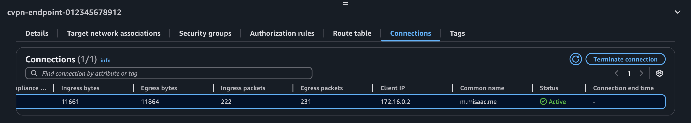

+++
title = "Connecting GitHub Codespaces to AWS VPN via SPIFFE/SPIRE & IAM Roles Anywhere"
slug = "connecting-github-codespaces-to-aws-vpn-via-spiffe-spire-and-iam-roles-anywhere"
description = "Learn how to authenticate your GitHub Codespace to AWS VPN using SPIRE-issued X.509 certificates and AWS IAM Roles Anywhere"
date = "2025-05-19"
[taxonomies] 
tags = [
  "spiffe/spire",
  "identity",
  "secrets management",
  "zero trust",
  "aws",
  "codespaces",
  "iam",
  "vpn",
  "terraform",
  "github",
  "iac"
]

+++

## Preamble

In [Grant AWS Access to GitHub Codespaces via SPIFFE/SPIRE & IAM Roles Anywhere](https://misaac.me/blog/grant-aws-access-to-codespaces-via-spiffe-spire-iam-roles-anywhere/), we setup a SPIRE Server and SPIRE Agent and successfully authenticated to AWS using a SPIRE issued certificate. 

In this post, we'll be building on that work, with the goal of using the same certificate to authenticate to AWS Client VPN.

### Prerequisites
- All the setup in the previous [post](https://misaac.me/blog/grant-aws-access-to-codespaces-via-spiffe-spire-iam-roles-anywhere/)
- AWS resource that we'll be connecting to via the VPN, e.g. an EC2 instance


## Setup the VPN Server Certificate

This builds off the PKI we built in [Setting up our Public Key Infrastructure](http://misaac.me/blog/grant-aws-access-to-codespaces-via-spiffe-spire-iam-roles-anywhere/#setting-up-our-public-key-infrastructure-pki). We create a certificate signing request for our vpn server and have it signed by our Root CA. Then we add said certificate to AWS ACM so that we can reference it later when we setup our AWS Cient VPN endpoint.

```
# 3. VPN Server Private Key
resource "tls_private_key" "vpn_server_key" {
  algorithm = "RSA"
  rsa_bits  = 2048
}

# 4. VPN Server Certificate Signing Request (CSR)
resource "tls_cert_request" "vpn_server_csr" {
  private_key_pem = tls_private_key.vpn_server_key.private_key_pem

  subject {
    common_name  = "vpn.misaac.me"
    organization = "Misaac Org"
    country      = "US"
  }

  dns_names = ["vpn.misaac.me"]
}

# 5. Root CA Signs VPN Server Certificate (leaf cert)
resource "tls_locally_signed_cert" "vpn_server_cert" {
  cert_request_pem   = tls_cert_request.vpn_server_csr.cert_request_pem
  ca_private_key_pem = tls_private_key.root_ca_key.private_key_pem
  ca_cert_pem        = tls_self_signed_cert.root_ca_cert.cert_pem

  validity_period_hours = 8760 # 1 year

  allowed_uses = [
    "server_auth",
    "client_auth",
    "digital_signature",
    "key_encipherment",
  ]

  is_ca_certificate = false # It's a leaf cert (not a CA)
}

# 6. Upload VPN Server Certificate (and chain) to ACM
resource "aws_acm_certificate" "vpn_server_cert" {
  private_key       = tls_private_key.vpn_server_key.private_key_pem
  certificate_body  = tls_locally_signed_cert.vpn_server_cert.cert_pem
  certificate_chain = tls_self_signed_cert.root_ca_cert.cert_pem
}
```

<br>

## Setup our Client Certificate (SVID)

As we have the SPIRE agent setup from our work in the previous post, all we need to do is request a certificate from it. 

```
$ bin/spire-agent api fetch x509 -write /tmp/          
Received 1 svid after 254.053709ms

SPIFFE ID:              spiffe://misaac.me/myservice
SVID Valid After:       2025-05-19 11:06:54 +0000 UTC
SVID Valid Until:       2025-05-19 12:07:04 +0000 UTC
Intermediate #1 Valid After:    2025-05-18 21:04:32 +0000 UTC
Intermediate #1 Valid Until:    2025-05-19 21:04:42 +0000 UTC
CA #1 Valid After:      2025-04-29 01:29:07 +0000 UTC
CA #1 Valid Until:      2035-04-27 01:29:07 +0000 UTC

Writing SVID #0 to file /tmp/svid.0.pem.
Writing key #0 to file /tmp/svid.0.key.
Writing bundle #0 to file /tmp/bundle.0.pem.

```

<br>

## Setting up Client VPN
{{ include_md(path="clientvpn.md") }}


If all went well, you should see this:

```
@mbuotidem ➜ /workspaces/mbuotidem.github.io (main) $ sudo openvpn --config o.ovpn
Mon May 19 00:40:17 2025 OpenVPN 2.4.12 x86_64-pc-linux-gnu [SSL (OpenSSL)] [LZO] [LZ4] [EPOLL] [PKCS11] [MH/PKTINFO]
[AEAD] built on Jun 27 2024
Mon May 19 00:40:17 2025 library versions: OpenSSL 1.1.1f 31 Mar 2020, LZO 2.10
Mon May 19 00:40:17 2025 TCP/UDP: Preserving recently used remote address: [AF_INET]3.XXX.XXX.72:443
Mon May 19 00:40:17 2025 Socket Buffers: R=[1048576->1048576] S=[212992->212992]
...

Mon May 19 00:40:19 2025 Outgoing Data Channel: Cipher 'AES-256-GCM' initialized with 256 bit key
Mon May 19 00:40:19 2025 Incoming Data Channel: Cipher 'AES-256-GCM' initialized with 256 bit key
Mon May 19 00:40:19 2025 ROUTE_GATEWAY 10.0.0.1/255.255.0.0 IFACE=eth0 HWADDR=7c:1e:52:5b:bf:9b
Mon May 19 00:40:19 2025 TUN/TAP device tun0 opened
Mon May 19 00:40:19 2025 TUN/TAP TX queue length set to 100
Mon May 19 00:40:19 2025 /sbin/ip link set dev tun0 up mtu 1500
Mon May 19 00:40:19 2025 /sbin/ip addr add dev tun0 172.16.0.13/27 broadcast 172.16.0.31
Mon May 19 00:40:19 2025 /sbin/ip route add 172.31.0.0/16 via 172.16.0.1
Mon May 19 00:40:19 2025 Initialization Sequence Completed
```

You can now leave that terminal window running, open a new one, and ssh, curl, or otherwise connect to the resource in your private subnet!


On the AWS Side, you can see the connection info if you visit your VPN endpoint's info page. Notice how our common name shows up, indicating we're connected using a certificate. 



## Wrapping Up

That’s it! You've now used your SPIRE issued SVID twice, first to [grab](http://misaac.me/blog/grant-aws-access-to-codespaces-via-spiffe-spire-iam-roles-anywhere/#use-a-spiffe-svid-to-obtain-aws-credentials-via-iam-roles-anywhere) AWS credentials, via AWS IAM Anywhere, and now, to connect to AWS Client VPN. 

In our next post, we'll move beyond the local developer machine context and explore using SPIFFE/SPIRE to grant Kubernetes clusters not running on AWS access to AWS API's vi IAM Roles Anywhere. 