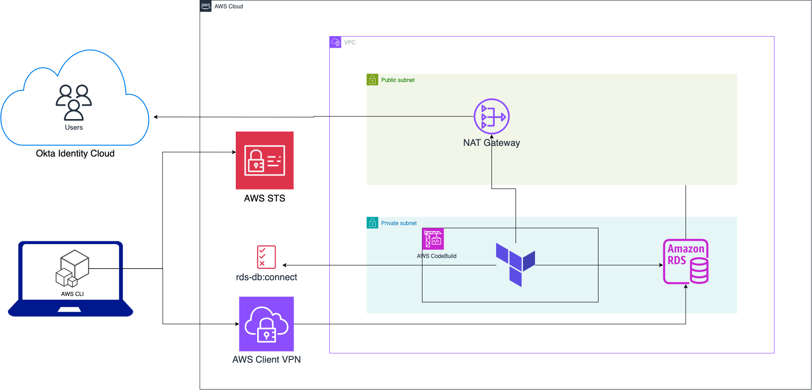

+++
title = 'Grant Passwordless Access to Amazon RDS with Okta, IAM, and Terraform'
slug= "grant-passwordless-access-aws-rds-via-iam"
description = "Learn how to securely grant passwordless access to Amazon RDS by leveraging Okta, AWS IAM database authentication, and Terraform"
date = "2025-07-05"
[taxonomies] 
tags = ["AWS", "RDS", "Okta", "IAM", "Terraform", "IaC"]
+++

### Introduction
Developers often find themselves needing direct database access. It might be to debug slow queries, check migrations, or push a last resort data fix. But granting secure, individualized, developer access without leaving long-term credentials lying around can quickly become an unmanageable operational burden.

In this post, we'll replace native DB credentials with [IAM Database authentication](https://docs.aws.amazon.com/AmazonRDS/latest/UserGuide/UsingWithRDS.IAMDBAuth.html). We'll also automate the entire lifecycle with Terraform, from DB creation to granting IAM-based database access to developers sourced from Okta. Once we're done, our devs can use their short-lived IAM credentials to connect. 


### Prerequisites
Keep an open mind as we'll be breaking some rules of Terraform automation. In addition, make sure you have:
- An Okta admin account
- Okta integrated with AWS IAM Identity Center
- A VPC with private and public subnets
- A Terraform runner with network access to your RDS subnet
- The runner should be using HashiCorp Terraform 1.11.0 and above
- The Terraform runner must also have `psql` and `jq` installed

Although we use Okta as our IdP here, note that if you strip away the Okta specific parts, this will still work with other IdP's including the native IAM Identity Center. And if you don't already have a Terraform runner with the required access, consider using [Codebuild's](https://docs.aws.amazon.com/codebuild/latest/userguide/action-runner.html) GitHub integration. 


### Architecture

1. Users are managed in Okta Identity Cloud
1. Terraform deploys the RDS database within a private subnet
1. Terraform creates `rds-db:connect` IAM policy using db identifier and policy variable
1. Terraform retrieves user and group information from Okta and creates roles for said users in DB
1. Terraform attaches policy to corresponding Okta groups in IAM Identity Center
1. Users obtain temporary database credentials using IAM Identity Center 
1. Users connect to the RDS database via AWS Client VPN and temporary database credentials


>Note: While we use a VPN here, you can still achieve the same using [SSM Port Forwarding](https://aws.amazon.com/blogs/database/securely-connect-to-amazon-rds-for-postgresql-with-aws-session-manager-and-iam-authentication/) via an EC2 instance or ECS Fargate task. 


### Setup Okta

#### Obtain Okta API Credentials

Since we'll be accessing the Okta API from Terraform, we need to setup an Okta application that will provide the credentials. Follow the guide at [Enable Terraform access for your Okta org](https://developer.okta.com/docs/guides/terraform-enable-org-access/main/) to get setup. The steps abbreviated are:

1. Create an API service app


1. Assign your app an admin role


1. Grant your app API scopes


1. Create access credentials using PEM format
    
    >Caution: The private key appears in this dialog only once. Losing the private key requires generating a new key pair. 

<br>
    
#### Add credentials to Terraform

1. Next, lets create an AWS secret manager resource to store this credential. 
    ```
    resource "aws_secretsmanager_secret" "okta_private_key" {
      name = "okta-private-key"
      description = "Private key for Okta API access"
    }
    ```

    We don't create an `aws_secretsmanager_secret_version` resource here intentionally as we'll be creating and managing it manually via the web console. This is sometimes done for compliance reasons where secret creation for certain high value secrets most involve a manual auditable step. 


1. Next add the okta provider to the `required_providers`. Update the version to the latest available version on the [Okta Provider](https://registry.terraform.io/providers/okta/okta/latest/docs) page.
    ```
    terraform {
        required_providers {
            okta = {
                source = "okta/okta"
                version = "~> 4.19.0"
            }
        }
    }
    ```


1. Then, add the provider to your `providers.tf`. 
    
    Note our usage of the `ephemeral` resource to retrieve and pass the okta private key to the Okta provider. [Ephemeral resources](https://developer.hashicorp.com/terraform/language/resources/ephemeral) in Terraform are **not persisted to the state file** which is ideal for a secret of this nature. 
    ```
    ephemeral "aws_secretsmanager_secret_version" "okta_private_key" {
      secret_id = aws_secretsmanager_secret.okta_private_key.id
    }
    provider "okta" {
      # org_name is first part of orgs's Okta domain before .okta.com
      org_name = "{yourOktaOrg}" 
      base_url = "okta.com"
      client_id   = "{yourClientID}"
      scopes = ["okta.groups.manage","okta.users.manage"]
      private_key = ephemeral.aws_secretsmanager_secret_version.okta_private_key.secret_string
    }
    ```

1. Finally, test access with a resource and output

    ```
    data "okta_group" "admins" {
      name = "Admins"
    }

    output "okta_group" {
      value = data.okta_group.admins.id
    }
    ```

    Running `terraform plan` should show the group id. 

If you hate the idea of doing anything in the web console, or your compliance environment allows for it,  you could create the okta credential using `aws_secretsmanager_secret_version` with the value passed via a `TF_VAR_name` environment variable and `secret_string_wo`. The `wo` refers to `write-only`, a [new argument](https://developer.hashicorp.com/terraform/language/resources/ephemeral/write-only) that tells terraform that we don't want it **storing the value in the state file, now, or ever**. 


### Provision the Amazon RDS Postgres Database

Let's use the modules from [Terraform AWS modules](https://github.com/terraform-aws-modules) to setup our DB. IAM database authentication works with MariaDB, MySQL, and PostgreSQL, but for this guide, we'll focus on PostgreSQL.

First, we'll create a security group.
```
module "security_group" {
  source  = "terraform-aws-modules/security-group/aws"
  version = "~> 5.0"

  name        = local.name
  description = "Complete PostgreSQL example security group"
  vpc_id      = aws_vpc.main.id

  # ingress
  ingress_with_cidr_blocks = [
    {
      from_port   = 5432
      to_port     = 5432
      protocol    = "tcp"
      description = "PostgreSQL access from within VPC"
      cidr_blocks = aws_vpc.main.cidr_block
    },
  ]

  tags = local.tags
}
```
Next, let's setup the db. 

```
module "db" {
  source = "terraform-aws-modules/rds/aws"

  identifier = local.name

  # All available versions: https://docs.aws.amazon.com/AmazonRDS/latest/UserGuide/CHAP_PostgreSQL.html#PostgreSQL.Concepts
  engine                   = "postgres"
  engine_version           = "14"
  engine_lifecycle_support = "open-source-rds-extended-support-disabled"
  family                   = "postgres14" # DB parameter group
  major_engine_version     = "14"         # DB option group
  instance_class           = "db.t4g.large"
  allocated_storage     = 20
  max_allocated_storage = 100
  db_name  = "completePostgresql"
  username = "complete_postgresql"
  port     = 5432

  iam_database_authentication_enabled = true #--> needed for IAM auth

  manage_master_user_password_rotation              = true
  master_user_password_rotate_immediately           = false
  master_user_password_rotation_schedule_expression = "rate(15 days)"
}
```

The essential options here are `iam_database_authentication_enabled = true`, which enables IAM authentication for the database, and `manage_master_user_password_rotation = true`, which lets AWS automatically manage and rotate the master password using Secrets Manager.

### Grant IAM database access
As mentioned earlier, IAM Database access relies on the `rds-db:connect` permission. The `rds-db:` prefix and `rds-db:connect` actions are only valid in the context of IAM database authentication. 

While you can assign this permission with a wildcard, granting access to any database in the account, we're going to do the right thing™ and use least privilege. To do this, we'll take advantage of a neat little trick, [IAM policy variables](https://docs.aws.amazon.com/IAM/latest/UserGuide/reference_policies_variables.html).  

#### Write DB access IAM policy
You use IAM  policy variables as placeholders when you don't know the exact value of a resource or condition key when you write the policy. 

Without this, we'd have to create a policy statement for each user that needs access in a group. Beyond being unwieldy and inelegant, this approach doesn't scale because we'll quickly run into IAM policy [character limits](https://docs.aws.amazon.com/IAM/latest/UserGuide/reference_iam-quotas.html#reference_iam-quotas-entity-length). 

Instead, we'll lean on the `saml:sub` policy variable, one of the ways to [uniquely identify users in SAML-based federation](https://docs.aws.amazon.com/IAM/latest/UserGuide/id_roles_providers_saml.html#CreatingSAML-userid). `saml:sub` is the subject of the claim, which includes a value that uniquely identifies an individual user within an organization. At most orgs, this is the user's email, e.g. `you@yourcompany.com`. In other words, the effectiveness of the `saml:sub` policy hinges on the SAML assertion from Okta mapping the user's subject field to the email. 


Here's the policy - the `join` function is only used to allow display of the full arn in the code snippet. 

```
data "aws_iam_policy_document" "db_access" {
  statement {
    sid = "1"

    actions = [
      "rds-db:connect",
    ]

    resources = [
        join(
            "",
            [
                "arn:aws:rds-db:${var.region}$:",
                data.aws_caller_identity.current.account_id,
                ":dbuser:",
                module.db.db_instance_resource_id,
                "/",
                "$${saml:sub}"
            ]
        )
    ]

    condition {
      test     = "StringEquals"
      variable = "saml:sub_type"
      values   = ["persistent"]
    }
  }
}

resource "aws_iam_policy" "db_access_policy" {
  name   = "rds-db-access-policy"
  path   = "/"
  policy = data.aws_iam_policy_document.db_access.json
}
```
Notice that we have to escape the literal `${` that would otherwise introduce a template sequence.

#### Create permission set 
A permission set in AWS IAM Identity Center is analagous to an IAM Role in classic IAM. It defines the permissions that a federated user will get during their short-lived session. 

We'll create a permission set that will be assumed by our users when they want to connect to the DB. This permission set doesn't have to be solely used for db access, it could just as well be a permission set that grants other permissions in addition to db access. 


```
data "aws_ssoadmin_instances" "sso" {
}

resource "aws_ssoadmin_permission_set" "db_access_permission_set" {
  name             = "db_access_permission_set"
  description      = "Permission set for RDS DB access via IAM"
  instance_arn     = data.aws_ssoadmin_instances.sso.arns[0]
  session_duration = "PT1H"
  tags = {
    Purpose = "RDS DB Access"
  }
}
```
#### Attach IAM DB access policy to permission set
For the permission set to grant access, it needs a policy attachment. That's what we're doing here: 
```
resource "aws_ssoadmin_customer_managed_policy_attachment" "db_access_policy_attachment" {
  instance_arn       = aws_ssoadmin_permission_set.db_access_permission_set.instance_arn
  permission_set_arn = aws_ssoadmin_permission_set.db_access_permission_set.arn
  customer_managed_policy_reference {
    name = aws_iam_policy.db_access_policy.name
    path = "/"
  }
}
```

#### Assign permission set to account where DB resides
Account assignment is where you assign a permission set to a user or group for a specific AWS account. IAM Identity Center then provisions an IAM Role in that account with policies attached that reflect the permissions defined in the permission set. 

```

data "aws_identitystore_group" "admins" {
  provider          = aws.sa-east-1
  identity_store_id = tolist(data.aws_ssoadmin_instances.sso.identity_store_ids)[0]

  alternate_identifier {
    unique_attribute {
      attribute_path  = "DisplayName"
      attribute_value = data.okta_group.admins.name
    }
  }
}


resource "aws_ssoadmin_account_assignment" "assign_admins" {
  instance_arn       = tolist(data.aws_ssoadmin_instances.sso.arns)[0]
  permission_set_arn = aws_ssoadmin_permission_set.db_access_permission_set.arn

  principal_id   = data.aws_identitystore_group.admins.group_id
  principal_type = "GROUP"

  target_id   = data.aws_caller_identity.current.account_id
  target_type = "AWS_ACCOUNT"
}

```
<br>

### Provision users in the DB
IAM DB authentication requires the users to have DB users that are mapped to an IAM user or role. Our users already exist via the Okta/IAM Identity Center integration, and above, we just granted them the IAM permissions to access the DB. What's left is to create the equivalent users in the DB. When granting access however, it's crucial to also plan for revocation. We'll tackle this DB user provisioning and revocation here, starting with revocation. 

#### Planning for User Revocation
Before we provision users in the database, we need to plan for revocation. When users leave the organization or lose access permissions, we need to both remove their database roles AND terminate any active sessions they might have.

You should have this project run as part of both your onboarding and offboarding. With Okta [Event hooks](https://developer.okta.com/docs/concepts/event-hooks/) you can trigger the GitHub pipeline using the `repository_dispatch` [event](https://docs.github.com/en/webhooks/webhook-events-and-payloads#repository_dispatch). This will update the roles in the database, ensuring that it matches the state in Okta. 

For our revocation mechanism, we'll create a bash script that is responsible for revoking active user sessions. The `postgresql_role` resource we'll create shortly handles the declarative removal of the role from the database. Our script serves a different, specific purpose: to terminate active connections, which would otherwise persist until the user manually disconnects. Note that for this to work your Terraform runner environment must have `psql` and `jq` installed. 

```bash
#manage_all_user_sessions.sh
#!/bin/bash
set -euo pipefail

: "${DB_HOST?}"
: "${DB_ADMIN_USER?}"
: "${DB_NAME?}"
: "${OKTA_USERS_JSON?}"
: "${PGPASSWORD?}"

OUTPUT_FILE="terminated_sessions.json"
# Initialize/create the output file with an empty JSON array.
# This ensures the file exists even if the script exits prematurely later.
echo "[]" > "$OUTPUT_FILE"

# Convert Okta users JSON to SQL array
OKTA_USERS_SQL_ARRAY=$(
  echo "$OKTA_USERS_JSON" | jq -r --arg q "'" '
    if length > 0 then "ARRAY[" + $q + join($q + "," + $q) + $q + "]"
    else "ARRAY[]::text[]"
    end
  '
)

# SQL query to find and terminate sessions for non-superusers not in the Okta list,
# and return a JSON array of the terminated usernames.
SQL_QUERY="
SELECT COALESCE(json_agg(usename), '[]'::json)
FROM (
    SELECT usename, pg_terminate_backend(pid)
    FROM pg_stat_activity psa
    JOIN pg_roles pr ON psa.usesysid = pr.oid
    WHERE
      psa.pid <> pg_backend_pid()
      AND psa.usename ~ '^[a-zA-Z0-9._%+-]+@[a-zA-Z0-9.-]+\\.[a-zA-Z]{2,}$'
      AND psa.usename <> ALL (${OKTA_USERS_SQL_ARRAY})
      AND pr.rolname <> 'rdsadmin'
      AND pr.rolcanlogin
      AND NOT pr.rolsuper
) t;
"

# Execute the query and capture the resulting JSON array.
TERMINATED_USERS_JSON=$(
  psql -v ON_ERROR_STOP=1 \
    -h "$DB_HOST" \
    -U "$DB_ADMIN_USER" \
    -d "$DB_NAME" \
    -tAc "${SQL_QUERY}"
)

# Write the JSON array of terminated users to the output file.
# If the query returned nothing, write an empty array.
echo "${TERMINATED_USERS_JSON:-[]}" > "$OUTPUT_FILE"

```
Our SQL query uses the most recent user list from Okta to determine which active user sessions in the DB should be terminated. It takes advantage of `pg_terminate_backend` and `pg_stat_activity` to figure out the active sessions, and terminate those that belong to users that are no longer authorized. 

#### Run revocation
We begin breaking some rules of proper Terraform automation here. Many consider writing directly to a database during a `terraform apply` to be an anti-pattern. This is because it moves us away from simply provisioning resources, to mutating data or application state that it is argued should ideally be managed outside of the declarative infrastructure lifecycle.

However, the real world is messy, and sometimes a sparing and conscious hack like this is a perfectly reasonable compromise. Just be sure to document it and understand the risks.

Lets grab the users we intend to grant access to. We're using `Admins` here, but it could as well be `Developers`, `DBAs`, `Data Analysts` or whatever group needs access. Note also that what we're about to do, writing to the database, only works if your Terraform runner also has network access to the just created DB. 

```
data "okta_users" "admins" {
  group_id = data.okta_group.admins.id
}
```
Next we'll call our revocation script using the list of `okta_users`. 

```
resource "terraform_data" "terminate_stale_sessions" {
  # This ensures the script re-runs whenever the list of Okta users changes.
  triggers_replace = data.okta_users.admins.users[*].email

  provisioner "local-exec" {
    command     = "bash ${path.module}/manage_all_user_sessions.sh"
    interpreter = ["/bin/bash", "-c"]

    # Pass all parameters as environment variables
    environment = {
      PGPASSWORD        = local.password
      DB_HOST           = local.host
      DB_ADMIN_USER     = local.username
      DB_NAME           = local.database
      OKTA_USERS_JSON   = jsonencode(data.okta_users.admins.users[*].email)
    }
  }

  lifecycle {
    create_before_destroy = true
  }

  depends_on = [module.db]
}

# Data source to read the file generated by the script
data "local_file" "terminated_sessions_report" {
  filename = local.terminated_sessions_file

  # Ensure this runs after the script has potentially (re)created the file
  depends_on = [terraform_data.terminate_stale_sessions]
}

output "terminated_sessions_info" {
  description = "Information about terminated database sessions based on Okta user list."
  value       = jsondecode(data.local_file.terminated_sessions_report.content)
}

```
We use the `terraform_data` resource, the native successor to `null_resource`, because it doesn't require a provider to be configured.


#### Provision the user roles in the DB
Next, we'll use the latest Okta user list to create matching roles in the database. For this, we'll leverage a Terraform [PostgreSQL provider](https://registry.terraform.io/providers/cyrilgdn/postgresql/latest/docs). To configure the provider, we'll retrieve the AWS-managed master password from the RDS module and use it to authenticate. Once again, we'll use the `ephemeral` resource type.

```
ephemeral "aws_secretsmanager_secret_version" "secret-version" {
  secret_id = module.db.db_instance_master_user_secret_arn
}

locals {
  host     = substr(module.db.db_instance_endpoint, 0, length(module.db.db_instance_endpoint) - 5)
  username = "complete_postgresql"
  database = "completePostgresql"
  password = jsondecode(ephemeral.aws_secretsmanager_secret_version.secret-version.secret_string)["password"]
  terminated_sessions_file = "${path.module}/terminated_sessions.json" 
}

terraform {
  required_providers {
    # other providers omitted
    postgresql = {
          source  = "cyrilgdn/postgresql"
          version = "1.25.0"
        }
  }
}

provider "postgresql" {
  host            = local.host
  database        = local.database
  username        = local.username
  password        = local.password
  sslmode         = "require"
  connect_timeout = 15
  superuser       = false # required for RDS users. AWS doesn't grant us superser, but instead `rds_superuser`
}
```

We can now use the `postgresql_role` resource to create our users, making sure to grant them the [`rds_iam`](https://docs.aws.amazon.com/AmazonRDS/latest/UserGuide/UsingWithRDS.IAMDBAuth.DBAccounts.html#UsingWithRDS.IAMDBAuth.DBAccounts.PostgreSQL) permission. IAM authentication **takes precedence over password authentication**, so any users granted `rds_iam` must log in as an IAM user.

```
resource "postgresql_role" "okta_users" {
  for_each = toset(data.okta_users.admins.users[*].email)
  name     = each.value
  login    = true
  roles    = ["rds_iam"] # needed for IAM auth
}
```


### Profit

We now have everything needed to connect to our AWS RDS DB via IAM. To do so, we obtain an IAM authentication token using the AWS CLI, and then use said token as our password. Here are the steps:

1. Set AWS environment variables - this could be via [`aws sso login`](https://docs.aws.amazon.com/cli/latest/userguide/cli-configure-sso.html#cli-configure-sso-login) directly or using a tool like [granted](https://github.com/fwdcloudsec/granted)

1. Download the required SSL certificate from [https://truststore.pki.rds.amazonaws.com/global/global-bundle.pem](https://truststore.pki.rds.amazonaws.com/global/global-bundle.pem)

1. Export your DB host address to your current terminal:
    ```bash
    export RDSHOST=complete-postgresql.randomstring.us-east-1.rds.amazonaws.com
    ```

1. Generate the IAM token using your Okta email:
    ```bash
    export PGPASSWORD="$(
      aws rds generate-db-auth-token \
      --hostname $RDSHOST \
      --port 5432 \
      --region your-region \
      --username you@yourcompany.com
    )"
    ```

1. Connect to your DB using the IAM token and the SSL certificate:
    ```bash
      psql -h $RDSHOST -p 5432 \
        --dbname=completePostgresql \
        --username=you@yourcompany.com \
        --password \
        --set=sslmode=verify-full \
        --set=sslrootcert=global-bundle.pem
    ```
  
    When prompted, paste the value of $PGPASSWORD If everything worked out, you should see your psql prompt:

    ```
    psql (17.5, server 14.17)
    SSL connection (protocol: TLSv1.2, cipher: ECDHE-RSA-AES256-GCM-SHA384, compression: off, ALPN: none)
    Type "help" for help.

    completePostgresql=>
    ```

Note that the generated token works [just as well](https://aws.amazon.com/blogs/database/using-iam-authentication-to-connect-with-pgadmin-amazon-aurora-postgresql-or-amazon-rds-for-postgresql/) in pgAdmin, DataGrip, or your favorite database IDE. 
<br>

### Wrapping up

Now that our developers can access our database using IAM Database authentication, its worth pointing out some key concerns and limitations. First, developers might find the steps needed to obtain the token cumbersome. You should therefore wrap the individual AWS CLI calls in a custom, organization-specific script or CLI tool.

You'll likely need to grant additional privileges beyond just `rds_iam` to allow your users query or perform other actions on the database.  When you do this, you must ensure that **you never grant devs the permission to create roles**. This prevents bypassing IAM authentication. Also consider managing schema and sequence privileges in this project. This keeps all DB user privilege management operations version-controlled and will likely make your security auditors very happy. 

With regards to limitations, perhaps the most important is that CloudWatch and CloudTrail [**don't log**](https://docs.aws.amazon.com/AmazonRDS/latest/AuroraUserGuide/UsingWithRDS.IAMDBAuth.html) IAM Database authentication events. CloudWatch and CloudTrail do not track the `generate-db-auth-token` API calls that authorize the IAM role to enable database connection. 

Hence, if you're building this as part of some audit trail infrastructure, you might want to setup your own [near real-time](https://aws.amazon.com/blogs/database/enable-near-real-time-notifications-from-amazon-aurora-postgresql-by-using-database-triggers-aws-lambda-and-amazon-sns/) notification mechanism using the `aws_lambda` extension. This works on both [RDS for PostgreSQL](https://docs.aws.amazon.com/AmazonRDS/latest/UserGuide/PostgreSQL-Lambda.html) and [Aurora PostgreSQL](https://docs.aws.amazon.com/AmazonRDS/latest/AuroraUserGuide/PostgreSQL-Lambda.html). Additionaly, you'll likely want to setup [pgaudit](https://repost.aws/knowledge-center/rds-postgresql-pgaudit) for comprehensive auditing and [pgAudit Analyze](https://github.com/pgaudit/pgaudit_analyze) for easier querying of said auditing. 


That said, I find these tradeoffs acceptable. By automating the entire lifecycle with Terraform, from database provisioning to user role management, we reduce the operational burden of supporting engineering teams. Your developers get secure, individualized database access without compromising on security best practices, and your security team gets centralized control over who can access what, when.

> *Thanks to Jason Anderson and Matthew Nichols for their thoughtful feedback and suggestions.*

