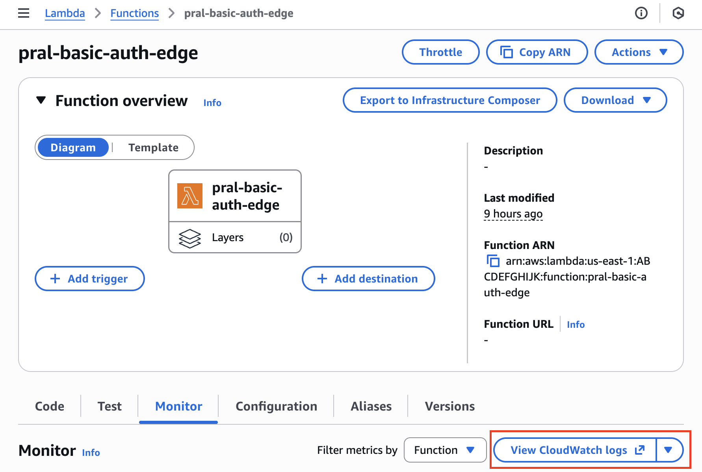
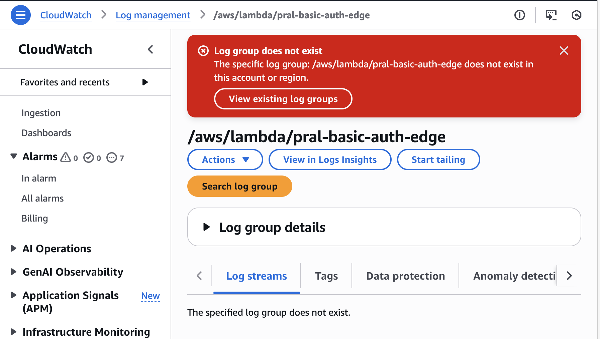
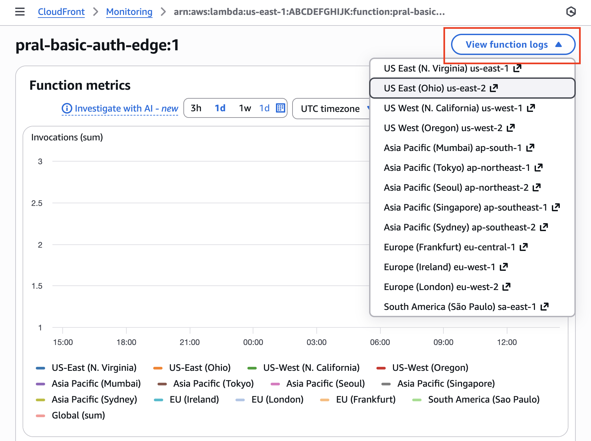

+++
title = "How to find Lambda@Edge Logs"
date = 2026-01-23
description = "Where are my Lambda@Edge logs? Here's how to find them"
draft = false

[taxonomies]
tags = ["aws", "cloudfront", "lambda"]

[extra]
toc = true
+++

Lambda@Edge is cool. You can use it to perform header modifications, alter your requests or responses, initiate auth flows, etc. When using them recently however, I struggled to find the logs for my edge Lambda. This article will show you how to find them. 

If you've used Lambda at all, your initial instinct might be to go to the `View CloudWatch Logs` link on the `Monitor` tab of your lambda. 

You'd quickly find however that said log group does not exist. 

The reason is hidden in the AWS [docs](https://docs.aws.amazon.com/AmazonCloudFront/latest/DeveloperGuide/edge-functions-logs.html#:~:text=You%20must%20review,to%20investigate%20issues.). Lambda@Edge logs are created in the regions where the functions are invoked. In my case, my function was deployed in `us-east-1`, but my physical location meant that when I visitied my CloudFront url, the version of the edge lambda that was invoked lived in `us-east-2`. So how do I find my Lambda@Edge logs? 

1. Go to CloudFront>Telemetry>Monitoring>Lambda@Edge

2. Click on your function name and then `View Function Logs`.

That's it! The key thing to remember is that Lambda@Edge logs appear in the region where your function was invoked, not where it was deployed. Using the CloudFront console is the easiest way to navigate to the right logs without having to guess which region to check.