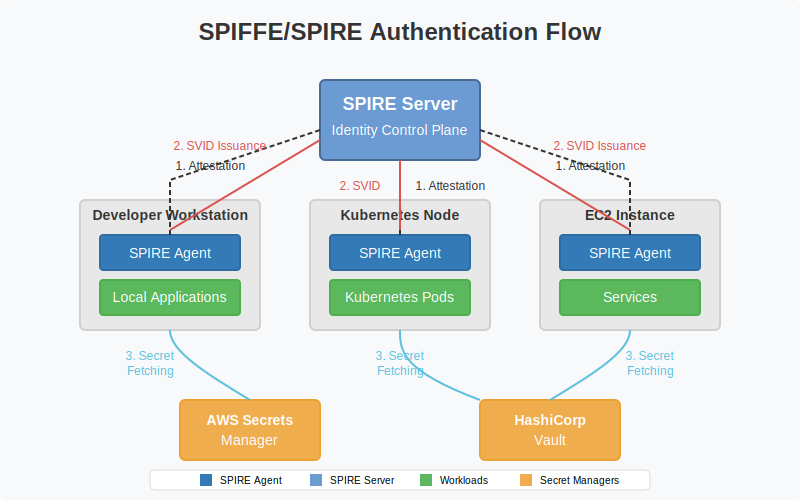

+++
title = "The Secret Problem Isn’t Secrets – It's Identity"
slug= "spiffe-spire-secret-sprawl-fix"
description = "Use spiffe/spire as the one source of truth for identity across your cloud, clusters, laptops, and runtime services"
date = "2025-05-07"
[taxonomies] 
tags = [
  "spiffe/spire",
  "identity",
  "secrets management",
  "zero trust",
  "aws"
]

+++

### Preamble

I recently stumbled across [SPIFFE/SPIRE](https://spiffe.io/), and the more I read about it, the more its core idea resonated with me. Most organizations suffer from secret sprawl: IAM credentials for cloud workloads, SSH keys for devs, .env files passed around in Slack, or API keys hardcoded into CI jobs. Revocation is a nightmare, auditing is incomplete, and breaches become treasure hunts for whatever got copied where.

A unified identity system spanning all my workloads, from developer machines to production services, would simplify my life as a security engineer.

### How SPIFFE/SPIRE Solves Secret Sprawl

SPIFFE gives every workload its own digital passport: a short-lived X.509 certificate called an [SVID](https://spiffe.io/docs/latest/spiffe-about/spiffe-concepts/#spiffe-verifiable-identity-document-svid), automatically issued by SPIRE or another compatible system. This certificate identifies the workload with a [SPIFFE ID](https://spiffe.io/docs/latest/spiffe-about/spiffe-concepts/#spiffe-id) (e.g. `spiffe://example.org/web/frontend`), lets the service prove who it is without dragging around long-lived secrets, expires quickly, and is rotated frequently so it's hard to steal or misuse.

But why would I need this if I already have a secrets manager? Because most secrets managers assume you’ve already solved identity. Vault wants a token. AWS Secrets Manager needs IAM credentials. But where do those come from in the first place? That’s the [secret zero problem](https://spiffe.io/docs/latest/spire-about/comparisons/).

With the certificate, that identity becomes the key to everything else. Inside your infra, you can often drop secrets entirely. Services use mutual TLS to prove who they are, and authorization logic decides what they can do. When secrets are still needed, for example for third-party APIs, the certificate gates access. Workloads authenticate to your secrets manager using their certificate and only get the secret they’re authorized for.

### How It Works

A SPIFFE-enabled system fetches secrets securely on demand. The flow looks something like this:

1. **[Attestation](https://spiffe.io/docs/latest/spire-about/spire-concepts/#attestation):**
   The SPIRE Agent first attests to the SPIRE Server through Node Attestation, proving the machine it's running on is trusted. This is done using cloud identity documents such as AWS instance identity. After the Server attests the node with out-of-band checks, the SPIRE Agent performs Workload Attestation, verifying the identity of workloads using markers like Kubernetes metadata or process runtime attributes.

2. **[SVID Issuance](https://spiffe.io/docs/latest/spire-about/spire-concepts/#a-day-in-the-life-of-an-svid):**
   If the attestation checks out, the SPIRE Server issues a short-lived X.509-SVID, bound to a SPIFFE ID, which the SPIRE Agent then delivers to the workload.

3. **[Secret Fetching](https://spiffe.io/docs/latest/keyless/vault/readme/):**
   The workload uses its SVID to authenticate to a secrets manager, fetching the secrets it needs without ever storing credentials locally.

### The Key Takeaway: Identity Comes First. Secrets Come Second.

While SPIFFE/SPIRE doesn’t magically eliminate secrets, it changes how we think about access. Instead of relying on possession of a token or API key, workloads prove their identity. That verified identity becomes the basis for gated, auditable access. You stop **distributing secrets** and **start issuing trust**. SPIFFE handles the identity while your app logic or [policy engine](https://spiffe.io/docs/latest/microservices/envoy-opa/readme/) decides what that identity is authorized to do.

Does this fix everything? Of course not. You'll likely need to use a [sidecar](https://github.com/spiffe/spiffe-helper) for your legacy apps, or build an [auth library](https://www.uber.com/blog/our-journey-adopting-spiffe-spire/) that abstracts the complexity of SVID retrieval and usage so your devs can focus on business logic. And if your team is still uploading .env files to Slack, you'll need to perform a culture overhaul on your way to secrets nirvana. 

And yes, all the SPIRE components represent another piece of infra to manage. You’ll have to think about SPIRE agent health, the SPIRE server DB/read replica health, and all the usual operational stuff. In return however, you'll gain observability, revocation, and a verifiable audit trail. 

### What this series covers

I’ll walk through setting up SPIRE on AWS and using it as the single source of identity for everything from dev machines to EKS workloads.

This won’t cover HA deployments, multi-region SPIRE, or plugging into enterprise PKI. But it’ll go over the basics and you can swap out the toy pieces for enterprise-grade alternatives that meet your security posture.

If you’ve ever wished for one source of truth for identity across your cloud, clusters, laptops, and runtime services — keep reading.

---

**Part 1:** [Grant AWS Access to GitHub Codespaces via SPIFFE/SPIRE & IAM Roles Anywhere](https://misaac.me/blog/grant-aws-access-to-codespaces-via-spiffe-spire-iam-roles-anywhere/)

**Part 2:** [Connecting GitHub Codespaces to AWS VPN via SPIFFE/SPIRE & IAM Roles Anywhere](https://misaac.me/blog/connecting-github-codespaces-to-aws-vpn-via-spiffe-spire-and-iam-roles-anywhere/)

**Part 3:** [Automated AWS Credential Renewal Using SPIFFE Helper and IAM Roles Anywhere](https://misaac.me/blog/automated-aws-credential-renewal-spiffe-helper-roles-anywhere/)

**Part 4:** [Grant AWS Access to Kubernetes Workloads via SPIFFE/SPIRE & IAM Roles Anywhere](https://misaac.me/blog/grant-aws-access-to-kubernetes-workloads-via-spiffe-spire-and-iam-roles-anywhere/)
