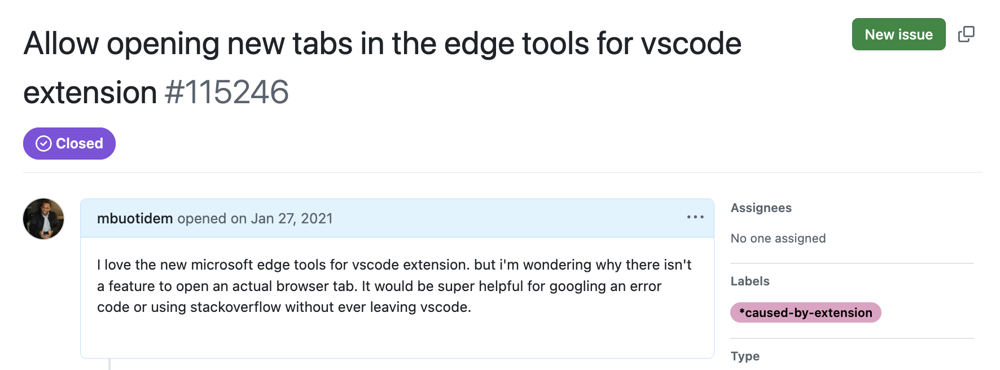

+++
title = "First look at Visual Studio Code's Integrated Browser"
date = 2026-02-07
description = "Finally, a browser in vscode!"

[taxonomies]
tags = ["ai", "coding", "agentic-ai"]

[extra]
toc = true
+++

I've always wanted a browser in vscode. Yes, I know, vscode is already kind of a browser being electron based and what not. That's why I was always so disappointed I had to have both vscode and a browser open to do work. In fact, here's proof - I opened an issue on the [vscode repo](https://github.com/microsoft/vscode/issues/115246). 

In the intervening years, I'd make do with vscode's `Simple Browser` a [little known](https://www.youtube.com/watch?v=OqzC9b3ueX0) feature that lets you test and debug servers/sites running on localhost. I couldn't visit stackoverflow (remember that quaint site?) or read documentation but it did help to keep me in flow without alt-tabbing. 

But yesterday, while reading through vscodes release notes, I saw this little note about vscodes new [integrated browser](https://code.visualstudio.com/docs/debugtest/integrated-browser), now in preview. Well guess who was prescient?!!

Reading between the lines, I have the AI craze to thank for this. Putting the browser in vscode makes it so much easier to grab relevant context to feed to the model, right down to specific page elements. There is a big warning on the docs page that says the integrated browser is expermiental and may change. I sure hope change means improving, and not being deprecated. I'd be very sad to lose this! 

Sometimes, you're just ahead of your time.
