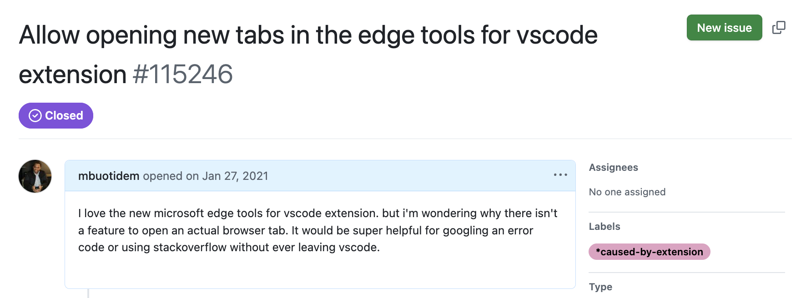

+++
title = "First look at Visual Studio Code's Integrated Browser"
date = 2026-02-07
description = "Finally, a browser in VS Code!"

[taxonomies]
tags = ["ai", "coding", "agentic-ai"]

[extra]
toc = true
+++

I've always wanted a browser in VS Code. Yes, I know, VS Code is already kind of a browser being electron based and what not. That's why I was always so disappointed I had to have both VS Code and a browser open to do work. In fact, here's proof - I opened an issue on the [VS Code repo](https://github.com/microsoft/vscode/issues/115246). 

In the intervening years, I'd make do with VS Code's `Simple Browser` a [little known](https://www.youtube.com/watch?v=OqzC9b3ueX0) feature that lets you test and debug servers/sites running on localhost. I couldn't visit stackoverflow (remember that quaint site?) or read documentation but it did help to keep me in flow without alt-tabbing. 

But yesterday, while reading through VS Codes release notes, I saw this little note about its new [integrated browser](https://code.visualstudio.com/docs/debugtest/integrated-browser), now in preview. Well guess who was prescient?!!

Reading between the lines, I have the AI craze to thank for this. Putting the browser in VS Code makes it so much easier to grab relevant context to feed to the model, right down to specific page elements. 

Sometimes, you're just ahead of your time.
