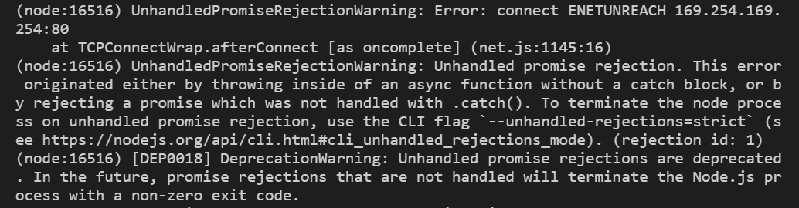

---
aliases:
- /2020/12/19/Error-connect-ENETUNREACH-169.254.169.254.80
author: Isaac Mbuotidem
date: '2020-12-19'
layout: post

---

When you are using the AWS Node.js SDK, you might encouter the error message :

`UnhandledPromiseRejectionWarning: Error: connect ENETUNREACH 169.254.169.254:80 at TCPConnectWrap.afterConnect [as oncomplete] (net.js:1145:16).`
\
\
{:class="img-responsive"}

\
\
This error is likely occuring because the AWS SDK is unable to find your AWS credentials. 
AWS Documentation has a list of ways you can [load credentials in Node.js](https://docs.aws.amazon.com/sdk-for-javascript/v2/developer-guide/setting-credentials-node.html)


\
Where the credential files are stored depends on your operating system. 

- on Linux, Unix, and macOS: `~/.aws/credentials`

- on Windows: `C:\Users\USER_NAME\.aws\credentials`


\
\
In my case, the issue was that I did not have a `[default]` profile in my aws credentials file. As such, I needed to tell the AWS Node.js SDK which profile to use instead. 

Assuming your profile is named `myspecial-profile, here's how you can do that :

```
const AWS = require('aws-sdk');
AWS.config.region = 'us-east-1';
var credentials = new AWS.SharedIniFileCredentials({profile: 'myspecial-profile'});
AWS.config.credentials = credentials;

```

Learn more about loading AWS credentials in Node.js from the [shared credentials file](https://docs.aws.amazon.com/sdk-for-javascript/v2/developer-guide/loading-node-credentials-shared.html){:class="lnk"}. 
