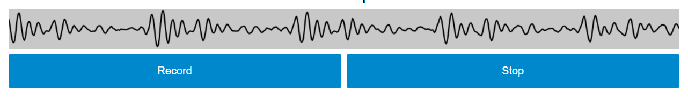

---
aliases:
- /2020/12/24/record-audio-in-blazor-using-mediarecorder-api-and-recorderjs
author: Isaac Mbuotidem
date: '2020-12-24'
layout: post
title: Record Audio In Blazor Using Mediarecorder Api And Recorderjs
---

I recently started playing with Blazor and I decided to build an app that needed to get  audio recorded from the users microphone via the browser. This post explains how I did that on Server Side Blazor.

I decided to go with using the browser's [MediaDevices](https://developer.mozilla.org/en-US/docs/Web/API/MediaDevices) interface in conjunction with Matt Diamond's aptly named [Recorder.js](https://github.com/mattdiamond/Recorderjs) library. Although Recorder.js is no longer actively maintained, it still works and more importantly, lets me record in `.wav` format which was part of my requirement. 

So how does all of this work in the context of a Blazor application? My approach boils down to the following:
1. Record the audio from the user's browser using JavaScript
2. Post the recorded audio blob to an API endpoint on my Blazor Server App using [XMLHttpRequest](https://developer.mozilla.org/en-US/docs/Web/API/XMLHttpRequest) and [FormData](https://developer.mozilla.org/en-US/docs/Web/API/FormData). 
3. Save the audio blob to a file on disk. 


## Record the audio from the user's browser using JavaScript and Recorder.js

As mentioned earlier, I'll be using the MediaDevices API along with Recorder.js to record the audio from the browser. The MediaDevices API has a method, [`getUserMedia()`](https://developer.mozilla.org/en-US/docs/Web/API/MediaDevices/getUserMedia) which enables recording of all sorts of media streams - audio, video, screen share etc. In our case, we will be using just the audio recording capability via Recorder.js. More on this in a second. 


### The user interface
The UI for the audio recording is lifted straight from the [web dictaphone](https://mdn.github.io/web-dictaphone/) sample. 


{:class="img-responsive"}


As the image above shows, we  have a record and stop button along with an HTML5 canvas that visualizes the audio stream being heard by the microphone. Credit for the visualizer code goes to [Soledad Penades](https://soledadpenades.com/).


Here is the Blazor component code for the UI above. I simply replaced the code that was in `Index.razor` but feel free to create and use a different component.

```
@page "/"
@inject IJSRuntime jsRuntime

<div class="wrapper mt-5">
    <section class="main-controls">
        <canvas id="canvas" class="visualizer" height="60"></canvas>
        <div id="buttons">
            <button class="@recordButton" disabled="@Recording" @onclick=Record>Record</button>
            <button class="stop" disabled="@NotRecording" @onclick=Stop>Stop</button>
        </div>
    </section>

    <section class="sound-clips">
    </section>
    <audio controls autoplay>
    </audio>
</div>


@code{
    string recordButton = "record";

    bool recording = false;
    bool notRecording = true;


    private async Task Record()
    {

        recordButton = "recording";
        recording = true;
        notRecording = false;
        await jsRuntime.InvokeVoidAsync("MyJSMethods.startRecording");
    }

    private async Task Stop()
    {
        recordButton = "record";
        recording = false;
        notRecording = true;
        await jsRuntime.InvokeVoidAsync("MyJSMethods.stopRecording");
    }

}
```

The field `recordButton` toggles the class of the record button from 'record' to 'recording'. We use this to change the record button's color to red when a recording is in progress and back to blue when recording is stopped.

The fields 'recording' and 'notRecording' are boolean, and are used to enable and disable clicking on the record and stop buttons depending on if a recording is in progress. 

The component's methods are pretty simple. `Record` toggles our CSS property fields and then calls out to a JavaScript function `startRecording` via the [IJSRuntime](https://blazor-university.com/javascript-interop/calling-javascript-from-dotnet/) service that enables Blazor's JavaScript interoperability. `Stop` toggles back the CSS fields and then calls the JavaScript function `stopRecording` to, well, stop recording. 

Below is the CSS for the component which I placed in `site.css`.
```
#buttons {
    display: flex;
    flex-direction: row;
    justify-content: space-between;
}

    #buttons button {
        font-size: 1rem;
        padding: 1rem;
        width: calc(50% - 0.25rem);
    }


.record {
    background: #0088cc;
    text-align: center;
    color: white;
}

    .record:hover, .record:focus {
        box-shadow: inset 0px 0px 10px rgba(255, 255, 255, 1);
        background: #0ae;
    }

    .record:active {
        box-shadow: inset 0px 0px 20px rgba(0,0,0,0.5);
        transform: translateY(2px);
    }

.recording {
    background: red;
    text-align: center;
    color: white;
}

.stop {
    font-size: 1rem;
    background: #0088cc;
    text-align: center;
    color: white;
    border: none;
    transition: all 0.2s;
    padding: 0.5rem;
}

    .stop:hover, .stop:focus {
        box-shadow: inset 0px 0px 10px rgba(255, 255, 255, 1);
        background: #0ae;
    }

    .stop:active {
        box-shadow: inset 0px 0px 20px rgba(0,0,0,0.5);
        transform: translateY(2px);
    }


```

Now that we understand how our Blazor component works, lets talk about the JavaScript part. 

### The JavaScript - `getUserMedia` and `Recorder.js`

Our first step is to add a link to Recorder.js in our `_Host.cshtml` page, right below the link to the Blazor server framework script. We also include an empty `<script>` tag that will contain our JavaScript.

```
<script src="_framework/blazor.server.js"></script>
<script src="https://cdn.rawgit.com/mattdiamond/Recorderjs/08e7abd9/dist/recorder.js"></script>
<script>
  
</script>

```

Next, we can start writing the JavaScript we need to record audio. Let's start with the functions that are called from C#. Note that the rest of the JavaScript code in this post should be placed within the empty `<script>` tag above. 

```
window.MyJSMethods = {

    startRecording: function () {
        navigator.getUserMedia({ audio: true }, onSuccess, onError);
    },

    stopRecording: function (element) {
        stop.click();
    },
}

```
`startRecording` above invokes the browser's [`getUserMedia`](https://developer.mozilla.org/en-US/docs/Web/API/MediaDevices/getUserMedia) method which prompts the user to grant us access to their microphone in order to start recording audio. If that request succeeds, then we invoke the `onSuccess` method which is where the actual recording takes place. If the user refuses to grant us access, then we call `onError`. The nice thing about the way this works is that the user is prompted to grant access only once - the browser will remember that access was granted on subsequent visits to your page. Lets look at `onError`.

```
let onError = function (err) {
    console.log('The following error occurred: ' + err);
};

```

`onError` simply logs the error to the console. This was fine by me during development but is not very useful for the end user. Consider improving this to issue an alert and tell the user "Hey, you need to grant us access to your microphone if you want us to record your audio!". Next up, <a name="onSuccess">`onSuccess`</a>, where the recording magic happens! 

```
let stop = document.querySelector('.stop');

let onSuccess = function (stream) {
    let recorder;
    let context;
    let audio = document.querySelector('audio');
    stop.disabled = false;

    let mainSection = document.querySelector('.main-controls');
    const canvas = document.querySelector('.visualizer');
    canvas.width = mainSection.offsetWidth;

    const canvasCtx = canvas.getContext("2d");

    context = new AudioContext();
    let mediaStreamSource = context.createMediaStreamSource(stream);
    recorder = new Recorder(mediaStreamSource);
    recorder.record();

    //visualize(stream, canvas, canvasCtx);


    stop.onclick = function () {
        recorder.stop();
        
        recorder.exportWAV(function (s) {
            wav = window.URL.createObjectURL(s);
            audio.src = window.URL.createObjectURL(s);
            let filename = new Date().toISOString().replaceAll(':', "");
            let fd = new FormData();
            fd.append("file", s, filename);
            let xhr = new XMLHttpRequest();
            xhr.addEventListener("load", transferComplete);
            xhr.addEventListener("error", transferFailed)
            xhr.addEventListener("abort", transferFailed)
            xhr.open("POST", "api/SaveAudio/Save/", true);
            xhr.send(fd);

        });

        stop.disabled = true;


        function transferComplete(evt) {
            console.log("The transfer is complete.");
            //GLOBAL.DotNetReference.invokeMethodAsync('Recognize', filename);

        }

        function transferFailed(evt) {
            console.log("An error occurred while transferring the file.");

            console.log(evt.responseText);
            console.log(evt.status);
        }

    }
}

```

`onSuccess` is called from `getUserMedia` which passes it a stream of the audio source. We then create the `recorder`, `context`, and `audio` variables. The API for Recorder.js is intuitive - to record, you call the `record` method on a `Recorder` object. A `Recorder` object takes a source and an optional config as parameters. In our case, we are using the browser's [`AudioContext`](https://developer.mozilla.org/en-US/docs/Web/API/AudioContext) interface as our source. `AudioContext` processes the stream into an audio source that our `Recorder` instance can use when we invoke its `record` method. The `audio` variable just holds a reference to the HTML5 audio element through which we will play back the recorded audio to the user.  

We also created two canvas related variables, `canvas` and `canvasCtx`, which we pass into a commented out call to the `visualize` function. This function handles the visualization of the audio stream and is not required for the recording to work. Ignore it for now - we will [circle back](#visualizer) to it. 

Next is our stopping mechanism. Outside `onSuccess`, we have a handle on the stop button. To stop recording, we attach a function to the stop button's `onclick` event which does a couple of things. First, it stops the recording and then uses Recorder.js's `exportWAV` method to export the audio blob as a `.wav` file. When the file is ready, we create a filename based on the timestamp. We set this file as the source for our HTML5 audio element to allow for immediate playback of the recorded audio. Then we post the audio file to our backend via `XMLHttpRequest`. 

Before we discuss how the file is posted to our backend, a quick word about the functions `transferComplete` and `transferFailed`. You can do whatever you want to based on the status of the transfer of the file via `XMLHttpRequest` by attaching event listeners to it. For example, in the actual application I was building, on a successful POST, I invoked a C# method, in the commented out line reproduced below:

```
//GLOBAL.DotNetReference.invokeMethodAsync('Recognize', filename);

``` 

This line triggered a method called Recognize in that version of my Blazor Component to perform speech recognition on the recorded audio file. To learn more about calling C# code from JavaScript via the Blazor JavaScript interop, see [here](https://docs.microsoft.com/en-us/aspnet/core/blazor/call-dotnet-from-javascript?view=aspnetcore-3.1) and [here](https://blazor-university.com/javascript-interop/calling-dotnet-from-javascript/).


## Post the recorded audio blob to an API endpoint on my Blazor Server App using `XMLHttpRequest` and `FormData`

Posting the audio blob is fairly straight forward. As mentioned earlier, we use the [XMLHttpRequest](https://developer.mozilla.org/en-US/docs/Web/API/XMLHttpRequest) and [FormData](https://developer.mozilla.org/en-US/docs/Web/API/FormData) objects. Here's that portion of the `onSuccess` function again:

```
recorder.exportWAV(function (s) {
    wav = window.URL.createObjectURL(s);
    audio.src = window.URL.createObjectURL(s);
    let filename = new Date().toISOString().replaceAll(':', "");
    let fd = new FormData();
    fd.append("file", s, filename);
    let xhr = new XMLHttpRequest();
    xhr.addEventListener("load", transferComplete);
    xhr.addEventListener("error", transferFailed)
    xhr.addEventListener("abort", transferFailed)
    xhr.open("POST", "api/SaveAudio/Save/", true);
    xhr.send(fd);
});

```

First we create the `FormData` object and then use its [`append`](https://developer.mozilla.org/en-US/docs/Web/API/FormData/append) method to add the filename we created as well as the recorded `.wav` file, here represented by `s`, to the form. Then we create the XMLHttpRequest object and attach event listeners for a successful transfer, as indicated by `load`, as well as for failures such as `error` and `abort`. 

Next, we initialize a `POST` request with XMLHttpRequest's `open` method, indicating the API endpoint url `api/SaveAudio/Save` as the target. And then we invoke the `send` method, performing the actual POST request with the `FormData` object containing our audio blob file as its payload. Note that if your API is on a different domain, you might need to take steps to resolve [CORS](https://docs.microsoft.com/en-us/aspnet/core/security/cors?view=aspnetcore-5.0) issues. 


### Setup required to create the .NET Web API endpoint

To add an API endpoint to our Blazor Server application, we need to make some changes to the `Startup.cs` class. Add the using statement for .Net Core MVC to the list of using statements. 

```
using Microsoft.AspNetCore.Mvc;

```

Then modify the `ConfigureServices` method, adding the Mvc service:

```
public void ConfigureServices(IServiceCollection services)
{
    services.AddMvc(options => options.EnableEndpointRouting = false).SetCompatibilityVersion(CompatibilityVersion.Latest);
    ...
}
```

Next, add `app.UseMvcWithDefaultRoute();` to the `Configure` method. I placed it right after `app.UseRouting()` and before `app.UseEndpoints()`;
```
public void Configure(IApplicationBuilder app, IWebHostEnvironment env)
    {
        ...
        app.UseRouting();
        
        app.UseMvcWithDefaultRoute();


        app.UseEndpoints(endpoints =>
        {
            endpoints.MapControllers();
            endpoints.MapBlazorHub();
            endpoints.MapFallbackToPage("/_Host");
        });
    }
```

With this setup in place, we can now create our API controller class. 


## Save the audio blob to a file on disk. 

To receive the audio, we will be creating an ASP.NET Core Controller with a method `Save`. The class itself is called `SaveAudio`. Together, these map to the the API endpoint `api/SaveAudio/Save` which we used earlier in the JavaScript code. To add this route to our controller, we use the [attribute route](https://docs.microsoft.com/en-us/aspnet/core/mvc/controllers/routing?view=aspnetcore-5.0) `[Route("api/[controller]/Save")]`. Below is the code. 


```
using Microsoft.AspNetCore.Http;
using Microsoft.AspNetCore.Mvc;
using System.IO;
using System.Threading.Tasks;


namespace BlazorAudioRecorder
{
    public class SaveAudio: Controller
    {
        Microsoft.AspNetCore.Hosting.IWebHostEnvironment _hostingEnvironment;

        public SaveAudio(Microsoft.AspNetCore.Hosting.IWebHostEnvironment hostingEnvironment)
        {
            _hostingEnvironment = hostingEnvironment;

        }

        [Route("api/[controller]/Save")]
        [HttpPost]
        public async Task<IActionResult> Save(IFormFile file)
        {
            if (file.ContentType != "audio/wav")
            {
                return BadRequest("Wrong file type");
            }
            var uploads = Path.Combine(_hostingEnvironment.WebRootPath, "uploads");
            
            var filePath = Path.Combine(uploads, file.FileName + ".wav");
            using (var fileStream = new FileStream(filePath, FileMode.Create))
            {
                await file.CopyToAsync(fileStream);
            }
            return Ok("File uploaded successfully");
        }
    }
}

```

The `Save` method will be invoked when an `HttpPost` request is made to the endpoint `api/SaveAudio/Save`. Notice that the name of the [`IFormFile`](https://docs.microsoft.com/en-us/dotnet/api/microsoft.aspnetcore.http.iformfile?view=aspnetcore-5.0) parameter is `file` which corresponds to the name we gave the audio blob when creating our `FormData` object earlier. Here is that specific line of JavaScript code again: 

```
fd.append("file", s, filename);

```

By doing this, we can rely on ASP.NET [model binding](https://docs.microsoft.com/en-us/aspnet/core/mvc/models/model-binding?view=aspnetcore-5.0) magic to match everything up for us. The rest of the code is fairly simple, we check if the content type matches our expectation of `audio/wav`. If it doesn't, we reject it, but if does, we go ahead and save the file to the `uploads` folder. You **must create a folder named `uploads` in the `wwwroot` folder of your application**, otherwise, your code will throw an exception since the destination you're asking it to save to doesn't exist. 


And there we have it! Compile, run, and record away! You can access the recorded files by visiting the `wwwroot/uploads` folder of your Blazor application. 


### <a name="visualizer">Visualizing </a> the audio stream

Here is the code snippet for visualizing the audio stream. Add it to your `_Host.cshtml` file. 

```
let audioCtx;

// This function visualizes the audio stream coming out of the user's microphone.
// Credit: Soledad Penades of https://soledadpenades.com/ via https://mdn.github.io/web-dictaphone/

function visualize(stream, canvas, canvasCtx) {
    if (!audioCtx) {
        audioCtx = new AudioContext();
    }

    const source = audioCtx.createMediaStreamSource(stream);

    const analyser = audioCtx.createAnalyser();
    analyser.fftSize = 2048;
    const bufferLength = analyser.frequencyBinCount;
    const dataArray = new Uint8Array(bufferLength);

    source.connect(analyser);
    //analyser.connect(audioCtx.destination);

    draw()

    function draw() {
        const WIDTH = canvas.width
        const HEIGHT = canvas.height;

        requestAnimationFrame(draw);

        analyser.getByteTimeDomainData(dataArray);

        canvasCtx.fillStyle = 'rgb(200, 200, 200)';
        canvasCtx.fillRect(0, 0, WIDTH, HEIGHT);

        canvasCtx.lineWidth = 2;
        canvasCtx.strokeStyle = 'rgb(0, 0, 0)';

        canvasCtx.beginPath();

        let sliceWidth = WIDTH * 1.0 / bufferLength;
        let x = 0;


        for (let i = 0; i < bufferLength; i++) {

            let v = dataArray[i] / 128.0;
            let y = v * HEIGHT / 2;

            if (i === 0) {
                canvasCtx.moveTo(x, y);
            } else {
                canvasCtx.lineTo(x, y);
            }

            x += sliceWidth;
        }

        canvasCtx.lineTo(canvas.width, canvas.height / 2);
        canvasCtx.stroke();

    }
}

```

Then make sure to uncomment 

```
//visualize(stream, canvas, canvasCtx);

```
in the [`onSuccess`](#onSuccess) method. When you click record, you should now see a visualization of the audio stream. 
<br/>
<br/>
<br/>
<br/>
### Github Source
[BlazorAudioRecorder](https://github.com/mbuotidem/BlazorAudioRecorder)
<br/>
<br/>
<br/>
<br/>
### Further Reading


[https://blog.addpipe.com/recording-audio-in-the-browser-using-pure-html5-and-minimal-javascript/](https://blog.addpipe.com/recording-audio-in-the-browser-using-pure-html5-and-minimal-javascript/)

[https://blog.addpipe.com/using-recorder-js-to-capture-wav-audio-in-your-html5-web-site/](https://blog.addpipe.com/using-recorder-js-to-capture-wav-audio-in-your-html5-web-site/)

[https://github.com/GersonRosales/Record-Audios-and-Videos-with-getUserMedia](https://github.com/GersonRosales/Record-Audios-and-Videos-with-getUserMedia)

[https://developer.mozilla.org/en-US/docs/Web/API/MediaStream_Recording_API/Using_the_MediaStream_Recording_API](https://developer.mozilla.org/en-US/docs/Web/API/MediaStream_Recording_API/Using_the_MediaStream_Recording_API
)

[https://hacks.mozilla.org/2016/04/record-almost-everything-in-the-browser-with-mediarecorder/](https://hacks.mozilla.org/2016/04/record-almost-everything-in-the-browser-with-mediarecorder/)

[https://mdn.github.io/web-dictaphone/](https://mdn.github.io/web-dictaphone/)

[https://khalidabuhakmeh.com/upload-a-file-using-aspdotnet-core](https://khalidabuhakmeh.com/upload-a-file-using-aspdotnet-core)