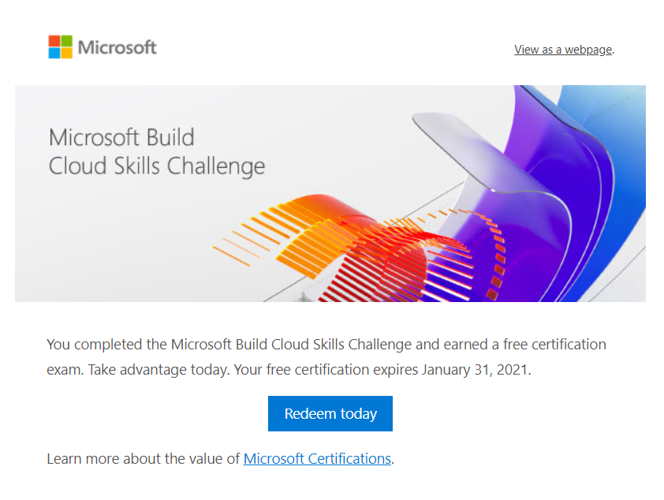
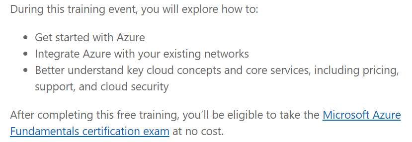

---
aliases:
- /2021/01/17/how-to-get-free-or-discounted-microsoft-azure-certifications
author: Isaac Mbuotidem
date: '2021-01-17'
layout: post

---

The new year often brings with it resolutions. If you're in tech, that might take the form of get a professional certification. If this is you and you'd like to do so without breaking the bank, here are some ideas for getting free or discounted certifications. 

One way to obtain certiications is to attend events sponsored by the cloud provider. These include industry conferences like Microsoft Build which is actually how I got my first free exam voucher. I'd attended Build last year and participated in the Cloud Skills Challenge and was therefore eligible for a free certification. However, I'd completely forgotten about it until I got a reminder email from Microsoft that my free certification voucher was expiring. (BTW, I got this reminder email 21 days to the expiry date so don't be like me and set your own reminder - 21 days might not be enough time to prepare for the cert you want!)

{:class="img-responsive"}

And just like that, I am now signed up to take the AZ-900 Azure Fundamentals exam at the end of this month. Blog post incoming on my approach to preparing for this. 

But what happens after AZ-900? How do I get more discounted certification vouchers? The answer is attend more Microsoft Events and take on more Microsoft Skills Challenges!

Microsoft offers [Virtual Training Days](https://www.microsoft.com/en-us/trainingdays) where devs and IT professionals can learn more about their offerings. Many of these events will tell you in the description if there is a certification offer as in the image below: 

{:class="img-responsive"}

Your other option is to sign up and participate in Microsoft [Cloud Skills Challenge - 30 Days to Learn It.](https://developer.microsoft.com/en-us/offers/30-days-to-learn-it) As the name implies, you sign up to take a challenge to prepare for a specific Microsoft certification in 30 days. If you complete your training, you become eligible for 50 percent off the cost of the certification. Caveat: you can only get a discounted certification code once every 6 months. So what are you waiting for?! Go sign-up already so that you can snag two discounted certifications this year! You've got this!

