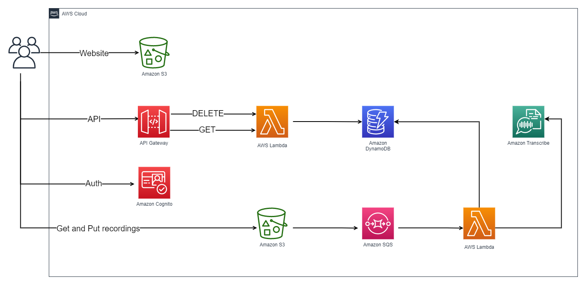

---
aliases:
- /2021/04/18/building-a-modern-web-application-using-aws-cdk-part-0
author: Isaac Mbuotidem
date: '2021-04-18'
description: First article in a series on building a serverless web application with
  the AWS CDK
keywords: aws, cloud-native, serverless
layout: post
title: Part 0 - Guichet - a cloud native web application built on AWS using the CDK

---

As part of my quest to become a cloud savvy software engineer, I recently took and passed the [AWS Certified Developer Associate](https://www.credly.com/badges/4fe237ab-1241-4b03-99f0-c9c37e6a26d4) (DVA-C01) exam. While having the certification is nice, I'd also like to demonstrate my understanding of building applications on AWS with a real world project. As such, I will be building a cloud native serverless web application on AWS called Guichet.

Guichet is a French word that denotes a grill opening, a small opening in the wall such as one you'd fine in a post office or cinema ticket window. It can also mean a counter, like one you'd find in a bank or again, a post office. It is this second meaning that hews to what I envision for the app, a one-stop location for world language teachers to issue and accept homework assignments, grade them, and perform several other language pedagogy related tasks. This is the long term vision for Guichet. In the short term however, I shall be focusing on a tiny slice of the desired functionality, namely, the ability to have students create audio recordings based on provided texts, and then view the transcriptions of said recordings side by side with the sample text in order to gauge their pronunciation ability. 

## Architecture Diagram

Below is an initial architecture diagram. The application will have a React front-end. This front-end will live in an Amazon S3 bucket and will authenticate users with Amazon Cognito. Signed in users can then make an audio recording which will be stored in a different Amazon S3 bucket. Upon storage of the recording, the metadata will be placed on an Amazon SQS queue. The queue will trigger an AWS Lambda which will perform the transcription using Amazon Transcribe and then store the transcribed text in an Amazon DynamoDB table. Users will then be able to view the transcriptions via the React frontend which will call a different AWS Lambda fronted by an Amazon API Gateway. 

{:class="img-responsive"}

## Architecture Decision Record

***React***: is the front-end for this project because React is a widely used and well supported library. As such, finding documentation or answers to thorny issues is likely to be easier. 

***Amazon Cognito***: Amazon Cognito provides user authentication, authorization and management. We will handle user authentication and authorization using Cognito because I am enticed by the idea of offloading a good chunk of the thorny job of login security to AWS. While I am aware that Cognito might have some serious kinks to [work out](https://www.reddit.com/r/aws/comments/m77p5g/aws_cognito_amplify_auth_bad_bugged_baffling/), I think the benefits it promises might make it worth while. 

***Amazon S3***: Amazon S3 is an object storage service from Amazon. All sorts of files can be stored on S3 and various AWS services also use S3 as their backend data store. S3 also makes an excellent static site host which is all we need to host our React frontend . It also allows for future extensibility such as the use of AWS CloudFront as a content delivery network. 

***API Gateway***: API Gateway allows developers to create endpoints that when hit, can invoke or hand off work to various AWS services. We will be triggering one of our lambda's through authenticated calls to API Gateway from our frontend. API Gateway works well for this purpose because it is tightly integrated with both Amazon Cognito and AWS Lambda. It also has very reasonable costs of operation. 

***AWS Lambda***: AWS Lambda allows you to run code in response to a variety of triggers. Your code can interact with both other AWS services and anything else you configure it to. Lambda's do all of this without the developer having to worry about provisioning or running servers. This should result in huge cost savings both in development time and compute cost. In addition, Lambda's tight integration with API Gateway which I alluded to earlier makes it a very versatile choice for handling the backend. 

***Amazon DynamoDB***: DynamoDB is a NoSQL key-value database offered by AWS. The data stored on DynamoDB is stored across AWS servers and fully managed by Amazon.DynamoDB is a perfect choice when one "has insufficient data for forecasting peaks and valleys in required database [performance](https://aws.amazon.com/blogs/database/how-to-determine-if-amazon-dynamodb-is-appropriate-for-your-needs-and-then-plan-your-migration/)". Given that this is a greenfield application, this is the exact situation we find ourselves in and thus, the choice to go with DynamoDB seems obvious. 

***Amazon SQS***: is a message queue service from AWS that we can use in  distributed applications to exchange messages through a polling model. It's value lies in its ability to decouple the sending of a message from the processing of said message. We will use SQS to trigger our second lambda which will be responsible for transcribing the audio and then storing the result in our DynamoDB table. 

***Amazon Transcribe***: Amazon Transcribe is a service form AWS that uses deep learning to perform automatic speech recognition. We choose it as our speech recognition service because of its low pricing and the fact that being part of the AWS ecosystem should make integration easier. 

***

Does this sound intriguing to you? If so, stay tuned for the [next post](https://mbuotidem.github.io/blog/2021/04/22/building-a-modern-web-application-using-aws-cdk-part-1.html) in the series where we shall begin working on our application's CI/CD pipeline. And if you'd like to dive into the code, here is a [link](https://github.com/mbuotidem/guichet) to the project on GitHub.
