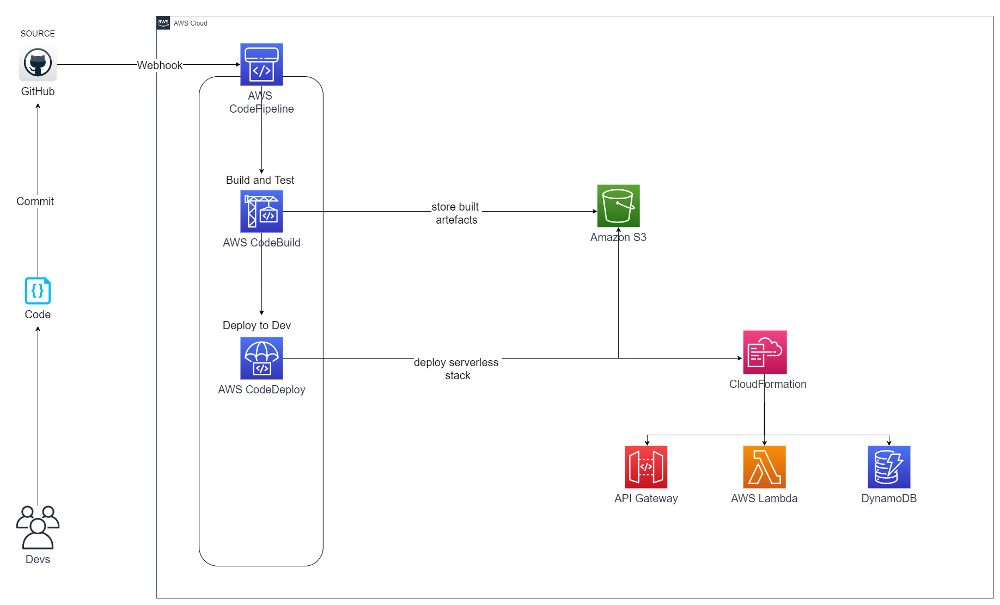

---
aliases:
- /2021/04/22/building-a-modern-web-application-using-aws-cdk-part-1
author: Isaac Mbuotidem
date: '2021-04-22'
description: Series on building a web application with the AWS CDK continued
keywords: aws, cdk, aws-cdk, devops, pipeline, infrastructure-as-code, projen
layout: post
title: Part 1 - Guichet - CI/CD pipeline architecture

---

The last [post](https://mbuotidem.github.io/blog/2021/04/18/building-a-modern-web-application-using-aws-cdk-part-0.html) in this series discussed our proposed architecture and provided an architecture decision record. In this post, we shall lay the foundation for building out Guichet's CI/CD pipeline. But what is a CI/CD pipeline?

### Continuous Integration, Continuous Deployment (CI/CD)
CI/CD is generally accepted to mean, continuous integration (CI), and then either continuous deployment or continuous delivery (CD). 

Continuous integration is the use of a central repository to manage the software development process. Developers continually push their changes to this central repository and these changes are immediately built and tested. 

Continuous delivery is the process of deploying the built and tested code artifacts from the continuous integration step above to a test environment. This is to allow for further verification of the software. So for example if you ran unit tests during continuous integration, you might now run UI tests, speed and performance tests, and maybe load tests. When you are satisified that the software is fit for purpose, then you could click on an approval button that would trigger the deployment of the code to production.

[Continuous deployment](https://avc.com/2011/02/continuous-deployment/) is an optional step. Whereas in continuous delivery, the built and tested software requires a manual approval action before going to production, with continous deployment, you have such high confidence in your software and battery of verfication procedures that you let changes make their way up to production without explicit approval. 

### The CI/CD Pipeline

A key component of CI/CD is the CI/CD pipeline. The pipeline refers to both the steps that must be performed in order to achieve CI/CD nirvana and the actual software infrastructure in use at each step. Components of a pipeline, also known as ***stages*** include: 

1. **Source**: You need somewhere to store the code that later parts of your pipeline will build and test. For Guichet, our source code repository will be GitHub. You can find the project on GitHub [here](https://github.com/mbuotidem/guichet).

2. **Build**: This is where the source code is compiled. We will be compiling our source code using Amazon's CodeBuild offering. 

3. **Test**: Our tests will also be run on AWS CodeBuild.

4. **Deploy**: We will use yet another AWS service, AWS CodeDeploy to handle the deployment of our code. 

You can learn more about CI/CD pipelines [here](https://semaphoreci.com/blog/cicd-pipeline).

### The Guichet CI/CD Pipeline

Our CI/CD Pipeline will be built on AWS CodePipeline. AWS CodePipeline is a managed CI/CD service that integrates the aforementioned services, AWS CodeBuild and AWS CodeDeploy. It also performs other useful orchestrating functions including the task of getting our code from the source code repository, sending notification on success/failure etc. 

Here is an architecture diagram that shows you how our CI/CD pipeline will function:

{:class="img-responsive"}

We will write code and commit/push said code to GitHub. Our GitHub repository will have a [webhook](https://docs.github.com/en/developers/webhooks-and-events/about-webhooks) configured that will notify AWS CodePipeline of the recently pushed code. AWS CodePipeline will fetch the code and then send it of to AWS CodeBuild to build and test it. If the tests are successful, we will publish the compiled source code to an Amazon S3 bucket. AWS CodePipeline will then tell AWS CodeDeploy to go grab the compiled source code from the Amazon S3 bucket and deploy it. Since we will be using the AWS CDK (Cloud Development Kit), one of the artifacts in our Amazon S3 bucket will be the AWS CloudFormation templates that defines the  needed infrastracture in the AWS Cloud. 

The AWS CloudFormation service will read and process the template and stand up the resources defined therein. 

### AWS CDK 
At this point, a brief discussion of AWS CloudFormation and the AWS CDK would be helpful. 

AWS CloudFormation is a service that allows developers to model, provision, and manage cloud infractructure via templates. These templates are called CloudFormation templates and can be either YAML or JSON files. Using CloudFormation allows us to practice infrastructure-as-code, which is the idea that our infrastructure should be treated the same way we treat our application code, it should be stored in version control, undergo code review, and be both reliable and repeatable. 

Unfortunately, defining cloud infrastructure via text files can be a very difficult and painful process. This is because cloud infrastructure often requires not just the definition of the resources and themselves, but also the Identity and Access Management (IAM) policies that should be attached to these resources for optimal security. Both the resources and their required IAM policies also come with an almost infinite amount of possible configurations which increases the complexity.

This is where the [AWS Cloud Development Kit](https://aws.amazon.com/cdk/) comes in. It is an open-source software development framework for defining cloud infrastructure as code. Developers can use their favorite modern programming language, (TypeScript, JavaScript, Python, Java, C#/. Net,) to setup their cloud infrastructure. The code they write will then be synthesized into a CloudFormation template. 

The [beauty](https://asrathore08.medium.com/aws-cdk-bring-the-power-of-programming-language-to-your-iac-3d0a6ebe39ff) of the CDK lies in the fact that developers do not have to write all the text defining their infrastructure themselves. Instead, by using the object oriented abstractions and high level constructs the CDK provides, they can define their desired infrastructure and have the CDK generate the template. In other words, with the CDK, you can generate a 1000 lines long AWS CloudFormation template that deploys 50 AWS resources with about 20 lines of code!  In addition, the constructs the CDK provides come with sane and sensible defaults which mean that developers can rest easy in the knowledge that their infrastructure has at least the minimum level of security.

Due to all the attendant [benefits](https://dev.to/hoangleitvn/top-reasons-why-we-use-aws-cdk-over-cloudformation-2b2f), we shall be using the CDK to define our CI/CD pipeline. In particular, we will begin by using the [CDK Pipelines](https://aws.amazon.com/blogs/developer/cdk-pipelines-continuous-delivery-for-aws-cdk-applications/) construct. CDK Pipelines is a an opinionated construct that comes with some pre-defined ***stages*** which correspond to logical phases of deployment. It does however let you add more stages to it based on the needs of their application. CDK Pipelines is also self-mutating. This means that after the initial deploy, the pipeline automatically updates itself if you add new cloud infrastructure or pipeline stages in the source code. This means that we can start building our application with a minimal set of cloud resources and only add more resources as needed. 

***

Liking the series? In our next [post](https://mbuotidem.github.io/blog/2021/04/23/building-a-modern-web-application-using-aws-cdk-part-2.html), we will build our initial CI/CD pipeline using the AWS Cloud Development Kit (CDK). You can find the previous post [here](https://mbuotidem.github.io/blog/2021/04/18/building-a-modern-web-application-using-aws-cdk-part-0.html) And if you'd like to dive into the code, here is a [link](https://github.com/mbuotidem/guichet) to the project on GitHub.
