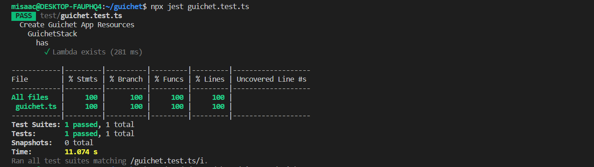

---
aliases:
- /2021/04/23/building-a-modern-web-application-using-aws-cdk-part-2
author: Isaac Mbuotidem
date: '2021-04-23'
description: Series on building a web application with the AWS CDK continued
keywords: aws, cdk, aws-cdk, devops, pipeline, infrastructure-as-code, projen
layout: post
title: Part 2 - Guichet - Building the CI/CD pipeline

---

The last [post](https://mbuotidem.github.io/blog/2021/04/22/building-a-modern-web-application-using-aws-cdk-part-1.html) in this series discussed our proposed architecture for our CI/CD pipeline. In this post, we shall build the actual CI/CD pipeline using the AWS CDK. But first, a crash course on CDK terminology.

A ***construct*** in CDK world refers to a cloud component. This can be a single resource like an Amazon S3 bucket, or it can be a grouping of several resources such as an S3 bucket connected to a lambda. 

A ***stack*** is a unit of deployment. It follows the same rules as a [CloudFormation stack](https://docs.aws.amazon.com/AWSCloudFormation/latest/UserGuide/stacks.html) and is made up of one or more constructs. For example, we can place both a single Amazon S3 bucket and/or an S3 bucket connected to a lambda in a stack.

An ***app*** is your final cloud application - what gets deployed. It can contain one or more Stacks and it's what gets synthesized into a CloudFormation template. The synthesized template is what the CloudFormation service will then use to provision the cloud resources that you defined. 

### Our Approach
We will create 2 stacks. First, we will create the application stack. For this iteration, the application will have just a simple placeholder lambda. Next, we will create a pipeline stack based on the [CDK Pipelines](https://aws.amazon.com/blogs/developer/cdk-pipelines-continuous-delivery-for-aws-cdk-applications/) construct. This pipeline stack will be responsible for getting our source code, building it, and deploying the application stack. The CDK Pipelines construct will get provisioned first, and then it will ensure that our application stack gets deployed. 

After both stacks have been successfully deployed, When we commit a change to the repo, the pipeline stack will first update itself (known as a self-mutation) as needed, and then it will redeploy the application. 

Note that this means that both the code for our application stack, and the code for the pipeline stack will live in the same repo. This setup means that we can easily change both our core application and our pipeline. For example, initially, we shall only have our application deployed to our development environment. In the future, we could then add a step for the application to be deployed to a production environment. The CDK Pipelines construct will do the heavy lifting of ensuring that all this works seamlessly. 

### The application stack

As mentioned earlier, we will start with just a single construct in our application stack, an AWS Lambda function. We will also export the name of said lambda function as an output. Below is the code:
```
import * as cdk from '@aws-cdk/core';
import * as lambda from '@aws-cdk/aws-lambda';


export class GuichetStack extends cdk.Stack {

    public readonly lambdaName: cdk.CfnOutput;

    constructor(scope: cdk.Construct, id: string, props?: cdk.StackProps) {
        super(scope, id, props);

        const transcriber = new lambda.Function(this, 'Transcriber', {
            runtime: lambda.Runtime.NODEJS_10_X,
            code: lambda.Code.fromAsset('lambda'),
            handler: 'transcriber.handler'
        });


        this.lambdaName = new cdk.CfnOutput(this, 'TranscriberLambdaName', {
            value: transcriber.functionName
        });
    }
}

```

This class, `GuichetStack`, is a construct, our very own construct that we've composed atop the in-built lambda function construct from the AWS CDK. We create a readonly property, `lambdaName`, which we will use to output the name of the lambda that gets created. The AWS CDK will auto-generate a name for the lambda and so if we want to know that name without going to search for it in the GUI page for Lambda, making it a `cdk.CfnOutput` is wise. 

We then create our lambda resource which we store in the variable `transcriber`. Notice how the AWS CDK lets us set up important attributes for our lambda such as the desired runtime and the name of the handler. We also tell it where the lambda code, reproduced below, can be found. We do that with `code: lambda.Code.fromAsset('lambda')` which says "Hey CDK, in this directory, there's a folder called lambda that contains the code for the lambda".  

```
exports.handler = async function (event) {
    console.log("request:", JSON.stringify(event, undefined, 2));
    return {
        statusCode: 200,
        headers: { "Content-Type": "text/plain" },
        body: `Hello! You've hit Guichet at ${event.path}\n`
    };
};

```
For now, we are just returning a simple string response to test that the lambda works. In later posts, we will build out the transcription logic. During the synthesis step, this lambda function will be packaged up and added to the CloudFormation stack that the AWS CDK will generate for us.

### Testing the application stack

Since our infrastructure is code, we should treat it just the same way we would treat our application code and that includes having tests. [Testing](https://docs.aws.amazon.com/cdk/latest/guide/testing.html) AWS CDK constructs is fairly easy. The CDK team has provided the CDK [assert](https://www.npmjs.com/package/@aws-cdk/assert?activeTab=readme) module which comes with helpers that simplify testing CDK code. This module relies on the [Jest](https://jestjs.io/) test framework. 

One of the helpers provided is the `toHaveResource` function. It allows you to check that a resource of a particular type exists(it does not evaluate logical identifiers), and that some properties are set to specific values. We use the `toHaveResource` helper here to verify that our application stack does indeed contain an AWS Lambda function with our desired runtime. Below is the test code: 

```
import '@aws-cdk/assert/jest';
import { App } from '@aws-cdk/core';
import { GuichetStack } from '../src/guichet';

describe('Create Guichet App Resources', () => {
    describe('GuichetStack', () => {
        const app = new App({ context: { '@aws-cdk/core:newStyleStackSynthesis': '1' } });

        describe('has', () => {

            let stack = new GuichetStack(app, 'test', {
            });


            test('Lambda exists', () => {
                expect(stack).toHaveResource("AWS::Lambda::Function", {
                    Runtime: "nodejs10.x"

                });
            });
        });
    });
});

```
 And here are the test results:

{:class="img-responsive"}

### The CDK Pipeline Stack

Before we create the pipeline itself, let us setup a pipeline stage. A stage represents a logical phase of the deployment. The code below, in the class `GuichetPipelineStage`, is our stage. We will later add it to our pipeline using `pipeline.addApplicationStage()` and passing it an instance. If we do not perform this step of adding an application stage, then we'd have a functional pipeline, albeit one that doesn't build our application. 

```
import { GuichetStack } from './guichet';
import { Stage, CfnOutput, Construct, StageProps } from '@aws-cdk/core';

export class GuichetPipelineStage extends Stage {
    public readonly lambdaName: CfnOutput;

    constructor(scope: Construct, id: string, props?: StageProps) {
        super(scope, id, props);

        const service = new GuichetStack(this, 'Guichet');

        this.lambdaName = service.lambdaName;

    }
}

```
We pull in our `GuichetStack` construct from [the application stack section above](#the-application-stack). We also pull in some necessary constructs from `@aws-cdk/core`. We subclass the pre-defined`Stage` construct which knows how to play nice with the CDK Pipeline construct. Th en we add a readonly property `lambdaName` so that we can surface the `lambdaName` property from our `GuichetStack` construct. We then instantiate our `GuichetStack` and finally set the `lambdaName` property to whatever is returned from `GuichetStack`. 

So now that our stage is all ready, the moment we've been building up to is here. Behold, our CDK Pipeline stack: 

```
import { App, Construct, Stack, StackProps, SecretValue } from '@aws-cdk/core';
import * as codepipeline from '@aws-cdk/aws-codepipeline';
import * as codepipeline_actions from '@aws-cdk/aws-codepipeline-actions';
import { SimpleSynthAction, CdkPipeline } from "@aws-cdk/pipelines";
import { StringParameter } from '@aws-cdk/aws-ssm';
import { GuichetPipelineStage } from './pipeline-stage';

export class GuichetPipelineStack extends Stack {
  constructor(scope: Construct, id: string, props: StackProps = {}) {
    super(scope, id, props);

    // define resources here...

    const sourceArtifact = new codepipeline.Artifact();
    const cloudAssemblyArtifact = new codepipeline.Artifact();

    const githubOwner = StringParameter.fromStringParameterAttributes(this, 'gitOwner', {
      parameterName: 'guichet-repo-owner'
    }).stringValue;

    const githubRepo = StringParameter.fromStringParameterAttributes(this, 'gitRepo', {
      parameterName: 'guichet-repo'
    }).stringValue;

    const githubBranch = StringParameter.fromStringParameterAttributes(this, 'gitBranch', {
      parameterName: 'guichet-repo-branch'
    }).stringValue;

    const pipeline = new CdkPipeline(this, 'Pipeline', {
      crossAccountKeys: false,
      cloudAssemblyArtifact,
      // Define application source
      sourceAction: new codepipeline_actions.GitHubSourceAction({
        actionName: 'GitHub',
        output: sourceArtifact,
        oauthToken: SecretValue.secretsManager('guichet-repo-git-token', { jsonField: 'guichet-repo-git-token' }), // this token is stored in Secret Manager
        owner: githubOwner,
        repo: githubRepo,
        branch: githubBranch
      }),
      // Define build and synth commands
      synthAction: SimpleSynthAction.standardNpmSynth({
        sourceArtifact,
        cloudAssemblyArtifact,
        installCommand: 'npm i -g npm && npm i -g aws-cdk@1.95.2 && npm install',
        synthCommand: 'npx cdk synth'
      })
    });

    pipeline.addApplicationStage(new GuichetPipelineStage(this, 'dev'));


  }
}

// for development, use account/region from cdk cli
const devEnv = {
  account: process.env.CDK_DEFAULT_ACCOUNT,
  region: process.env.CDK_DEFAULT_REGION,
};

const app = new App();

new GuichetPipelineStack(app, 'GuichetPipelineDev', { env: devEnv });
// new GuichetPipelineStack(app, 'GuichetPipelineProd', { env: prodEnv });

```

The code above does several things. 

`sourceArtifact/cloudAssemblyArtifact`: These will store our source code and cloud assembly respectively. A cloud assembly refers to the files that include everything needed to deploy your app to a cloud environment. For example, it could include an AWS CloudFormation template for each stack in your app, and a copy of any file assets (such as our lambda code) that you reference in your app.

`const x = StringParameter.fromStringParameterAttributes(...)`: Here we are following a [12 factor](https://12factor.net/) app best practice of ***strict separation of config from code***. We store the information regarding the source code repository in a Secrets Manager parameter so that it can be altered without changing the code. This allows us to meet the [litmus test](https://12factor.net/config) that the codebase can be open-sourced at any moment without compromising any credentials.  

`const pipeline = new CdkPipeline(...)`: This initializes the pipeline with the required values. This will serve as the base component moving forward. Every pipeline requires at bare minimum:

- `CodeCommitSourceAction(...)`: The sourceAction of the pipeline will check the designated repository for source code and generate an artifact.

- `SimpleSynthAction.standardNpmSynth`: The synthAction of the pipeline will take the source artifact generated in by the sourceAction and build the application based on the buildCommand. This is always followed by `npx cdk synth`

`pipeline.addApplicationStage(new GuichetPipelineStage(this, 'dev'));`: This is where we add the pipeline stage that will deploy our application stack. As alluded to [earlier](#the-cdk-pipeline-stack), all we had up to this point was a fully functional pipeline that could run and self-mutate, but would not deploy our application. Adding the stage tells the pipeline "After you're done grabbing the source code and self-mutating, lay the framework for the deployment of the application stack contained in the stage". 

`new GuichetPipelineStack(app, 'GuichetPipelineDev', { env: devEnv });`: Finally we attach our pipeline stack to a CDK App construct. The app gets synthesized into the CloudFormation template that will provision our cloud resources. The cool part of this is that if we wanted to provision this pipeline and the application it builds in another environment, all we'd need to do is add another similar line and then provide the environment information and then CDK will do it for us. For example, `new GuichetPipelineStack(app, 'GuichetPipelineProd', { env: prodEnv });`, would deploy `GuichetPipelineStack` in our production environment, provided the variable `prodEnv` contains the account and region number for said production environment.


### Testing the CDK Pipeline Stack

When testing the application stack above, we used the `toHaveResource` helper. To test the pipeline stack, we shall use both that and the  `toCountResources` helper. The `toCountResources` helper  checks that **n** number of resources of a particular type exist, with or without specific properties. Here is our test code: 

```
import { arrayWith, objectLike } from '@aws-cdk/assert';
import '@aws-cdk/assert/jest';
import { App } from '@aws-cdk/core';
import { GuichetPipelineStack } from '../src/main';


describe('Create Pipeline', () => {
  describe('GuichetPipeline', () => {
    const app = new App({ context: { '@aws-cdk/core:newStyleStackSynthesis': '1' } });

    describe('has', () => {

      let stack = new GuichetPipelineStack(app, 'test', {
      });

      test('Pipeline IAM roleS', () => {
        expect(stack).toCountResources('AWS::IAM::Role', 6);

      });

      test('Pipeline config', () => {
        expect(stack).toHaveResource('AWS::CodePipeline::Pipeline',
          {
            Stages: arrayWith({
              Name: 'Source',
              Actions: arrayWith(
                objectLike({
                  ActionTypeId: objectLike({}),
                  Configuration: objectLike({
                    Owner: objectLike({}),
                    Repo: objectLike({}),
                    Branch: objectLike({}),
                    OAuthToken: "{{resolve:secretsmanager:guichet-repo-git-token:SecretString:guichet-repo-git-token::}}",
                    PollForSourceChanges: false
                  }),
                  Name: 'GitHub',
                  OutputArtifacts: arrayWith(
                    objectLike({

                    })),
                  RunOrder: 1,

                })
              )
            })
          });
      });

      test('dev stage', () => {
        expect(stack).toHaveResource('AWS::CodePipeline::Pipeline',
          {
            Stages: arrayWith({
              Name: 'dev',
              Actions: arrayWith(
                objectLike({

                })
              )
            })
          });
      });

      test('1 pipeline resource', () => {
        expect(stack).toCountResources('AWS::CodePipeline::Pipeline', 1);

      });

      test('CodeBuild project', () => {
        expect(stack).toHaveResource('AWS::CodeBuild::Project');

      });

    });
  });
});

```

Our first test **'Pipeline IAM roles'** uses the 'countResources' to check for the existence of 6 IAM Roles which is the number of roles our pipeline currently needs to perform its tasks. 

Test **'Pipeline config'** tests that our pipeline has the right configuration to talk to our GitHub repo, i.e an owner, a repo, a branch, and a reference to the oauth personal access token secret. 

Test **'dev stage'** checks to ensure that our application stage, i.e the stage in which our application code is built, was added to the pipeline. 

Test **'1 pipeline resource'** verifies that our pipeline stack has a pipeline resource. 

And finally, test **'Codebuild project'** checks that our pipeline stack has a codebuild project which is what will build our cloud assemblies. 

Below is the result of the test run : 

{:class="img-responsive"}


***
Liking the series? In our next [post](https://mbuotidem.github.io/blog/2021/04/24/building-a-modern-web-application-using-aws-cdk-part-3.html), we will continue building out our backend, adding the S3 Bucket where our audio files will be stored, the DynamoDB table where the transcriptions will be saved, and all plumbing and required permissions for our lambda to interact with both resources. You can find the previous post [here](https://mbuotidem.github.io/blog/2021/04/22/building-a-modern-web-application-using-aws-cdk-part-1.html) And if you'd like to dive into the code, here is a [link](https://github.com/mbuotidem/guichet) to the project on GitHub.
