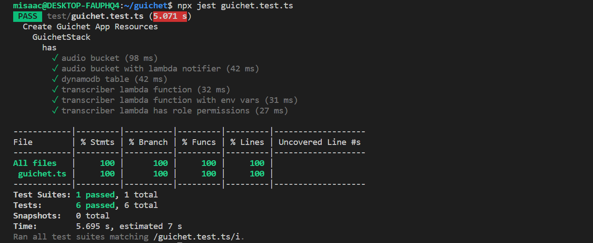

---
aliases:
- /2021/04/24/building-a-modern-web-application-using-aws-cdk-part-3
author: Isaac Mbuotidem
date: '2021-04-24'
description: Series on building a web application with the AWS CDK continued
keywords: aws, cdk, aws-cdk, devops, pipeline, infrastructure-as-code, projen
layout: post
title: Part 3 - Guichet - Building the application's resources

---

In our last [post](https://mbuotidem.github.io/blog/2021/04/23/building-a-modern-web-application-using-aws-cdk-part-2.html) we built out the CI/CD pipeline stack along with tests to verify that it works. In this post, we shall build out some of the cloud resources our application needs. Our application works like this: an audio file is uploaded to an S3 bucket. That upload triggers a lambda function which calls the Amazon Transcribe service, sending it the audio file that was just uploaded. The lambda will then store the transcription result in a DynamoDB table. We will continue using the AWS CDK infrastructure as code approach to add the S3 bucket and DynamoDB table to our application stack. We will also update our application's lambda function with necessary access permissions for the bucket, the DynamoDB table, and the Amazon Transcribe service. Let's get started.

### The S3 bucket
Creating an S3 bucket resource is simple with the AWS CDK. The same general pattern applies regardless of the construct. All you need do is import the module that contains said construct, and then make use of it. In this case, we need the s3 construct which we can find in the npm module  `@aws-cdk/aws-s3`. We create a bucket and set some of its properties such as the removal policy and the access permissions. You can learn more about the available bucket property options [here](https://docs.aws.amazon.com/cdk/api/latest/docs/@aws-cdk_aws-s3.Bucket.html). Finally, we use the `CfnOutput` construct to surface the name of the created bucket upon completion. 

```
import * as cdk from '@aws-cdk/core';
import * as s3 from '@aws-cdk/aws-s3';

//s3 audio bucket
const audioBucket = new s3.Bucket(this, 'AudioBucket', {
    removalPolicy: cdk.RemovalPolicy.DESTROY,
    publicReadAccess: true,
    accessControl: s3.BucketAccessControl.PUBLIC_READ,
});

new cdk.CfnOutput(this, 'audioBucket', { value: audioBucket.bucketName });
```

### The DynamoDB table

Next up is our DynamoDB table. Once again, a high level construct for it exists in `@aws-cdk/aws-dynamodb`.  In the code below, we use it to create our table and set its partition key. And once again, we use `CfnOutput` to output the name of the created table. You can learn more about the DynamoDB construct [here](https://docs.aws.amazon.com/cdk/api/latest/docs/aws-dynamodb-readme.html).

```
import * as cdk from '@aws-cdk/core';
import * as dynamodb from '@aws-cdk/aws-dynamodb';

//DynamoDB table for storing transcription results
const table = new dynamodb.Table(this, 'audioTranscriptions', {
    partitionKey: { name: 'audio', type: dynamodb.AttributeType.STRING }
});

new cdk.CfnOutput(this, 'ddbTable', { value: table.tableName });
```

### Updating our Transcriber lambda's resource definition
Our lambda resource's definition needs updating to account for the S3 bucket and DynamoDB table we've just created. Since we intend to communicate with these resources from within our lambda, we will need to know their names. In addition, we need to setup our lambda with the right permissions to access these resources. As usual, we pull in the module that contains the lambda construct, `aws-cdk/aws-lambda`. You can learn more about the lambda construct [here](https://docs.aws.amazon.com/cdk/api/latest/docs/aws-lambda-readme.html).

```
import * as cdk from '@aws-cdk/core';
import * as lambda from '@aws-cdk/aws-lambda';

//transcriber lambda
const transcriber = new lambda.Function(this, 'Transcriber', {
  runtime: lambda.Runtime.NODEJS_10_X,
  code: lambda.Code.fromAsset('lambda'),
  handler: 'transcriber.handler',
  timeout: Duration.seconds(300),
  memorySize: 1024,
  environment: {
      "TABLE_NAME": table.tableName,
      "BUCKET_NAME": audioBucket.bucketName,
  },
});

transcriber.addEventSource(new event_sources.S3EventSource(audioBucket, { events: [s3.EventType.OBJECT_CREATED] }));

audioBucket.grantRead(transcriber);

table.grantWriteData(transcriber);

transcriber.addToRolePolicy(new iam.PolicyStatement({
  effect: iam.Effect.ALLOW,
  actions: ['transcribe:StartTranscriptionJob'],
  resources: ['*'],
}))

```
In the code above, we access the table and bucket names from their respective objects and add them as environment variables for our lambda function. That way, our lambda code will be able to access that information easily. Next, we setup our s3 bucket as an event source for our lambda in the line `transcriber.addEventSource(new event_sources.S3EventSource(audioBucket, { events: [s3.EventType.OBJECT_CREATED] }));`. 

In the next two lines, we grant our lambda function the access permissions it needs to:
- read from the bucket:`audioBucket.grantRead(transcriber);` and
- write to the DynamoDB table: `table.grantWriteData(transcriber);`

Finally, in the last four lines of the code snippet above, we create the IAM Policy that gives our lambda the permission to interact with the Amazon Transcribe service. To figure out what actions were required for the IAM Policy, we just needed to carefully study the AWS Documentation for the service. In this case, the relevant information was available in an aptly named document, [How Amazon Transcribe works with IAM](https://docs.aws.amazon.com/transcribe/latest/dg/security_iam_service-with-iam.html). 


### Testing the application stack

Since our infrastructure is code, we should also write tests for it. Fortunately, [testing](https://docs.aws.amazon.com/cdk/latest/guide/testing.html) AWS CDK constructs is fairly easy. The CDK [assert](https://www.npmjs.com/package/@aws-cdk/assert?activeTab=readme) module comes with helpers that simplify testing CDK code. This module relies on the [Jest](https://jestjs.io/) test framework. In our test code, we check that our stack has the following resources :
- a bucket to store audio files
- a notifier that will call our lambda when something is uploaded to our bucket
- a DynamoDB table to store transcriptions
- a lambda function with the correct runtime
- a lambda function with the correct environment variables
- a lambda function with the correct permission and role policies to allow it to communicate with our S3 bucket, our DynamoDB table, and the Amazon Transcribe service 

<br/>

```
import '@aws-cdk/assert/jest';
import { App } from '@aws-cdk/core';
import { GuichetStack } from '../src/guichet';
import { ResourcePart } from '@aws-cdk/assert';


describe('Create Guichet App Resources', () => {
  describe('GuichetStack', () => {
    const app = new App({ context: { '@aws-cdk/core:newStyleStackSynthesis': '1' } });

    describe('has', () => {

      let stack = new GuichetStack(app, 'test', {
      });

      test('audio bucket', () => {
        expect(stack).toHaveResource('AWS::S3::Bucket', {
          Properties: {
            AccessControl: "PublicRead"
          },
          UpdateReplacePolicy: 'Delete',
          DeletionPolicy: 'Delete',
        }, ResourcePart.CompleteDefinition);

      });

      test('audio bucket with lambda notifier', () => {
        expect(stack).toHaveResource('Custom::S3BucketNotifications', {
          "NotificationConfiguration": {
            "LambdaFunctionConfigurations": [
              {
                "Events": [
                  "s3:ObjectCreated:*"
                ],
                "LambdaFunctionArn": {
                  "Fn::GetAtt": [
                    "Transcriber4926E100",
                    "Arn"
                  ]
                }
              }
            ]
          }
        });

      });


      test('dynamodb table', () => {
        expect(stack).toHaveResource("AWS::DynamoDB::Table", {
          AttributeDefinitions: [{ AttributeName: 'audio', AttributeType: 'S' }],
        });

      });

      test('transcriber lambda function', () => {
        expect(stack).toHaveResource('AWS::Lambda::Function', {
          Runtime: 'nodejs10.x',

        });
      });

      test('transcriber lambda function with env vars', () => {
        expect(stack).toHaveResource("AWS::Lambda::Function", {
          Environment: {
            Variables: {
              TABLE_NAME: { "Ref": "audioTranscriptions1A6D233C" },
              BUCKET_NAME: { "Ref": "AudioBucket96BEECBA" },
            }
          }
        });
      });

      test('transcriber lambda has role permissions', () => {
        expect(stack).toHaveResource("AWS::IAM::Policy", {
          PolicyDocument: {
            Statement: [
              {
                Action: [
                  "s3:GetObject*",
                  "s3:GetBucket*",
                  "s3:List*"
                ],
                Effect: 'Allow',
                Resource: [
                  {
                    "Fn::GetAtt": [
                      "AudioBucket96BEECBA",
                      "Arn"
                    ]
                  },
                  {
                    "Fn::Join": [
                      "",
                      [
                        {
                          "Fn::GetAtt": [
                            "AudioBucket96BEECBA",
                            "Arn"
                          ]
                        },
                        "/*"
                      ]
                    ]
                  }
                ],
              },
              {
                "Action": [
                  "dynamodb:BatchWriteItem",
                  "dynamodb:PutItem",
                  "dynamodb:UpdateItem",
                  "dynamodb:DeleteItem"
                ],
                "Effect": "Allow",
                "Resource": [
                  {
                    "Fn::GetAtt": [
                      "audioTranscriptions1A6D233C",
                      "Arn"
                    ]
                  },
                  {
                    "Ref": "AWS::NoValue"
                  }
                ]
              },
              {
                "Action": "transcribe:StartTranscriptionJob",
                "Effect": "Allow",
                "Resource": "*"
              }
            ],
            Version: '2012-10-17',
          },
          PolicyName: 'TranscriberServiceRoleDefaultPolicy45780372',
          Roles: [
            {
              Ref: 'TranscriberServiceRole495F268B',
            },
          ],
        });
      });
    });

  });
});
```


And here's our test run output:

{:class="img-responsive"}


***
Liking the series? In our next [post](https://mbuotidem.github.io/blog/2021/04/25/building-a-modern-web-application-using-aws-cdk-part-4.html), we will continue building out our backend, modifying our lambda to make the calls to the Amazon Transcribe service. You can find the previous post [here](https://mbuotidem.github.io/blog/2021/04/23/building-a-modern-web-application-using-aws-cdk-part-2.html) And if you'd like to dive into the code, here is a [link](https://github.com/mbuotidem/guichet) to the project on GitHub.
