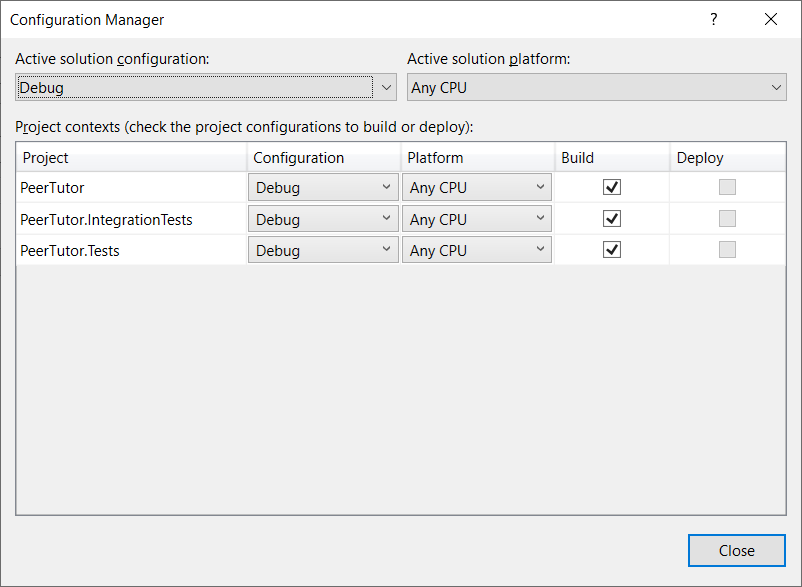

---
aliases:
- /2021/05/28/111-connection-refused-while-connecting-to-upstream-net-core-elastic-beanstalk
author: Isaac Mbuotidem
date: '2021-05-28'
description: How to resolve nginx 502 Bad Gateway / 111-connection-refused error due
  to .net web application start failure
keywords: aws, nginx, elastic beanstalk, 502 bad gateway, 111 connection refused
layout: post
title: Elastic Beanstalk 502 Bad Gateway / 111 connection refused while connecting
  to upstream error on .net

---

I recently tried to host a .NET web application on Elastic Beanstalk. I was using the AWS Toolkit for Visual Studio to handle the deployment so I thought everything would just go swimmingly. Initially, it seemed I was right - the application deployed successfully and the Elastic Beanstalk info page told me that the Environment was healthy. Nice. And then I clicked the url and I saw this lovely page: 

{:class="img-responsive"}


So off to Google to figure out what's wrong and sure enough, there were a couple of stackoverflow questions from users who had encountered this `502 Bad Gateway` error so things were looking hopeful. However, after trying a couple of suggestions from some of the stackoverflow results, it became clear that even though my error was the same, the root cause of the problem was definitely different from what was causing the issues for other users. 

So back to Google I went, this time, hoping for a blog post from some amazing developer who had encountered my problem before and could shed some light. I found this post by Martin Beebs [Elastic Beanstalk 502 Bad Gateway](https://thebeebs.net/2021/02/02/elastic-beanstalk-502-bad-gateway-error/). He was helping troubleshoot another dev's issues with deploying a .net core application using the AWS Visual Studio Toolkit which was exactly what I was trying to do. 

The gist of Martin's blog post was that when you deploy a .net core web application to Elastic Beanstalk, it saves the logs from your webserver to the file `web.stdout`. You can access these logs by using the Elastic Beanstalk Console to download the full logs for your environment which you will get as a zip file with a filename like `BundleLogs-123456789112`. Extract said zip and go to `/var/log/` and ideally, you should find the `web.stdout` file. Ideally, you should also find the error that your application's webserver is experiencing that's leading to the 502 Bad Gateway error in this file.

Armed with that knowledge, I went and got my logs from the Elastic Beanstalk console and then went looking for my `web.stdout` file and **there was no such log file**. What I did have though in `/var/log/nginx/` was the logs from Nginx which showed me the error `111-connection-refused-while-connecting-to-upstream, client: 12.345.678.910, server: , request: "GET / HTTP/1.1", upstream: "http://127.0.0.1:5000/", host: "pt-dev.us-east-1.elasticbeanstalk.com"` Searching for that error indicated that it could happen if your webserver wasn't even getting started. At this point, I knew that cowboy coding was not going to hack it anymore, I had to go consult the AWS documentation, and maybe even do a walkthrough. 

But first, I decided to eliminate my worry that perhaps my application just wasn't working on Elastic Beanstalk because I developed it on a Windows machine and I was trying to deploy it to a .net core Amazon Linux container. .NET core is cross-platform so this shouldn't be a valid concern, but hey, you never know, let's just make sure. Fortunately, the code was already on GitHub and I had access to the [GitHub Codespaces](https://github.com/features/codespaces) beta, so I launched a Codespace from the repo and ran the application and it worked there. So with that test, I knew that the application could run on a Linux box. So the problem likely was that there was some configuration I had to make in Elastic Beanstalk to tell it to run my application dll and where to find said dll. My assumption had been that the AWS Toolkit for Visual Studio would handle this for me but clearly, either it didn't, or it had set it up wrong. 

So back to troubleshooting on Elastic Beanstalk. I went back to the AWS documentation and I started reading everything under the section [Working with .NET Core on Linux](https://docs.aws.amazon.com/elasticbeanstalk/latest/dg/create-deploy-dotnet-core-linux.html). Eventually, I got to the page [Using a `Procfile` to configure your .NET Core on Linux environment](https://docs.aws.amazon.com/elasticbeanstalk/latest/dg/dotnet-linux-`Procfile`.html). It turns out, this is exactly where I can tell Elastic Beanstalk which applications I want it to run. Below is an example `Procfile`:

```
web: dotnet ./dotnet-core-app1/dotnetcoreapp1.dll
web2: dotnet ./dotnet-core-app2/dotnetcoreapp2.dll
```

Before going ahead to create my own `Procfile`, I decided to check if it was indeed true that the AWS Toolkit was not creating my `Procfile`. So I headed to the Elastic Beanstalk console and went to the `Application versions` page for my application. There I downloaded the .net core publish zip file that Elastic Beanstalk had created. And there was a `Procfile` in there. So what was the problem? Here is what I had in my `Procfile`: 

```
web: dotnet exec ./PeerTutor.IntegrationTests.dll
```

This means that instead of trying to run my web application, Elastic Beanstalk was trying to run the tests I had written for my application. I had several dotnet projects in my solution - my application, my application's unit tests, and my application's integration tests and I had them all setup to build in Configuration Manager as you can see in the screenshot below: 

{:class="img-responsive"}

For some reason, the AWS Toolkit decided that the application dll that needed to be added to the `Procfile` was the integration test instead of the actual web application's dll. So to solve this, all I had to do was uncheck the test projects in Configuration Manager, leaving only my web application. You can find Configuration Manager in Visual Studio 2019 by going to the Build menu item and it will be close to the bottom of the list - `Build>Configuration Manager`. 

{:class="img-responsive"}

And with that change, I rebuilt my application. Then I ran the AWS Toolkit wizard again and this time, it correctly added the web application to the `Procfile`. My `Procfile` now looked like this : 

```
web: dotnet exec ./PeerTutor.dll
```
And sure enough, when I visited my application url, this time around, it was live and running. And yes, I checked out my Full Logs again and yup, I now had a `web.stdout` file in there with all the log messages from the webserver. 


What's the moral of the story? I remember reading something on the AWS sub-reddit to the effect of "AWS documentation should be read as a book (read everything), and not as a quick consultation guide (stackoverflow post)". This is definitely the case. If I had spent the time upfront to read the documentation, I'd have known about the `Procfile` earlier and possibly been on the path to the solution sooner. 

Next up, I'm going to try running this application on Elastic Beanstalk via Docker, and then, I'll check out AWS' new competitor to Heroku, AWS AppRunner. But this time around, I'll be sure to go read the documentation first if I encounter any issues :)

